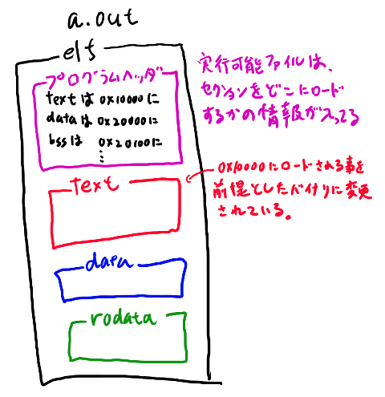
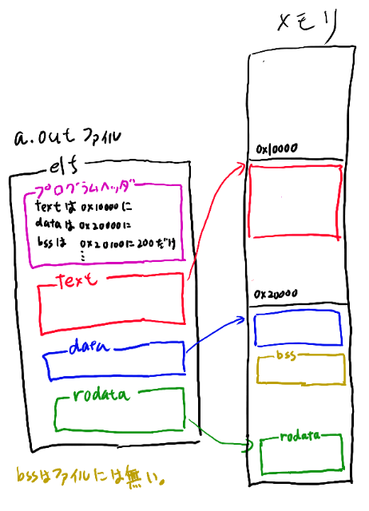
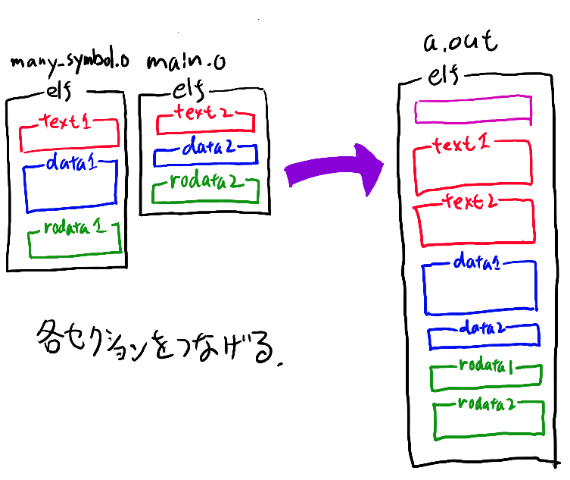
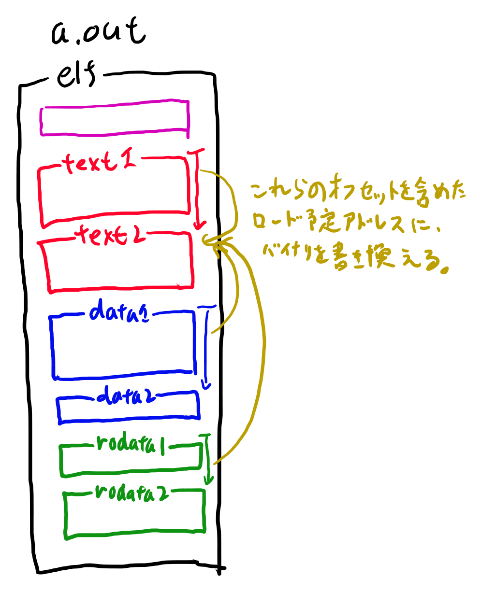

<style>
   .column{
        padding: 0.5em 1em;
        margin: 2em 0;
        color: #5d627b;
        background: white;
        border-top: solid 5px #5d627b;
        box-shadow: 0 3px 5px rgba(0, 0, 0, 0.22);
    }
</style>

第三回では、第二回で学んだバイナリやアセンブリの知識を元に、C言語の理解を深めていきます。

オブジェクトファイルやリンクなどを理解し、実行時のローダーの基本を理解すると、コンパイルやリンク、実行した時などのエラーを自分で解決出来るようになって便利です。

また、C言語の実際の挙動を調べる為にコンパイラにアセンブリを生成させて、それを調べる、というやり方を学びます。

第三回は[第二回 簡易アセンブラとディスアセンブラを作ろう](arm_asm.md)の続きです。
第二回を終えている事を前提に解説します。


# 01 アセンブリからC関数を呼ぶ

第二回では、ARM向けのコードはフルアセンブリで書いてきました。

ですがC言語のメリットの一つは、アセンブリとの親和性の高さです。
具体的にはアセンブリからC言語の関数を呼んだり、逆にCからアセンブリの関数（？）を呼んだりできます。

ここでは、最低限のセットアップだけでCの関数をアセンブリから呼ぶ、という事をやってみましょう。

### C言語の関数はアセンブリからどう見えなくてはいけないか？

C言語の関数がアセンブリからどう見えなくてはいけないのか？というのは、
実はC言語の仕様というレベルでは決まっていません。
決めるのは言語仕様では無く、ターゲットとなる環境が決めています。

各環境ごとのコンパイラが、C言語の仕様をターゲットの環境の定めるアセンブリのルールに変換する、という責任を持っている訳です。

ARMの場合は以下の文書が「C言語の関数は、アセンブリからどう見えないといけないか？」という決まりを説明したものになります。

[ARMのProceduer call standard](https://developer.arm.com/products/architecture/cpu-architecture/a-profile/docs/ihi0042/e/procedure-call-standard-for-the-arm-architecture)

読むのは面倒なのでここで必要な事だけ要約すると

- r0, r1, r2...と最初の方のレジスタを引数に使え
- r13にはスタックに使うアドレスをセットしておけ
- スタックはstmdb-ldmaiの方向に伸ばせ

という風になってないといけない、という事が書いてあります。

ドキュメントを頑張って読むよりは実際に見てみる方が早いので、以下、実際にやっていきましょう。

### volatile使ってC言語側でprint_msgを作る

以下にある、

```
sources/casm_link/01_call_c/1_1_call_c
```

hello.cの先頭にあるコメントを読んで、同じコマンドを実行してみましょう。
いつもの通りHello Worldが表示されたと思います。

ここでvolatileというのは、C言語のコンパイラにUARTのアドレスなど特別な意味を持つ、という事を教える為のキーワードです。
これが無いとただ無意味にメモリに値をひたすら上書きしているだけ、とコンパイラは判断し、最適化で最後に書き込んだ値のコードしか残してくれません。

そこでvolatileというキーワードをつけて、ここへの代入はメモリとは違って意味があるので、最適化しないでください、とコンパイラに指示を出します。

### hello_c.sを眺めてみる

以下ではhello_c.sとhello.cが実際にどう実行されていくかを見ていきましょう。

アセンブリ側は以下のようになっています。

```
.globl _start
_start:
    ldr r13,=0x07FFFFFF
    bl hello_c
loop:
    b loop
```

まずldr命令でr13にスタックに使うメモリのアドレスを指定している。これは2.5でやった奴ですね。

そして次が新しい。bl hello_cという行。
blはr15を保存しつつジャンプする、という奴でした。
問題はhello_c。

これはラベルに見えるけれど、そのラベルはこのファイル内には無い。
どこにあるか？というと、hello.cの側にあります。

次にこちらを見ていきましょう。

### hello.cを見てみる

ではC言語側を見てみましょう。

すると、以下のような関数が定義されています。

```
int hello_c() {
    ...
}
```

これが先ほどblしていたhello_cというラベルの正体になります。

もう少し詳しく見るべく、このCのソースがどういうアセンブリになるかをコンパイラに吐かせてみましょう。
その為には-Sというオプションを付けます。

sources/casm_link/01_call_c/1_1_call_cのhello.cをコンパイルしてアセンブリを吐く。

```
arm-none-eabi-gcc -O0 -fomit-frame-pointer hello.c -S -o hello_gcc.s
```

オプションの大文字のOは最適化を切る、という意味で、小文字の-oで出力先のファイル名を指定します。これでhello_gcc.sというファイルが生成される。omit frame pointerは生成されるコードを少しシンプルにする、というものです。あまり気にしなくてOK。

では中を見てみましょう。

最初の方に.eabi_attributeとかがずらずら出ますが、これらはあまり気にしないのがゆとり（自分も良く知りませんし、無くても最終的には同じバイナリになります）。

その次に、hello_cというラベルがある。

```
hello_c:
        @ Function supports interworking.
        @ args = 0, pretend = 0, frame = 0
        @ frame_needed = 0, uses_anonymous_args = 0
        @ link register save eliminated.
        ldr     r3, .L3
        mov     r2, #72
        strb    r2, [r3]
        ldr     r3, .L3
        ...
```

.L3ってなんだ？というと、最後の方に埋め込まれている、UARTのアドレスです。

```
.L3:
        .word   270471168
```

270471168ってなんだよ、というと、0x101f1000の事です。

r3にこのアドレスを入れて、あとはひたすらアスキーコードをstrbでこのアドレスに代入している訳ですね。
ここまで進めてきた人なら、この程度のアセンブリを読むのはなんでも無いでしょう。

最後の所はちょっと興味深い。


```
hello_c:
...
        mov     r3, #1
        mov     r0, r3
        bx      lr
```

lrはr14の事です。bxはthumb命令が絡むので詳細は説明しませんが、ようするにbの事です。
r14はbl命令で飛ぶ時に、飛ぶ元のアドレスを自動で入れてくれるのでした。
なのでb r14で呼び出し元にreturnする、というような意味になります。

r3に一回代入しているのは意味が分かりませんが(コンパイラはたまにこういう意味の無いコードを生成する)、ようするにr0に1を入れて、b r14してます。

これがC言語の関数という物をコンパイラがコンパイルする時の基本になります。
まとめると以下のようになります。

1. r13はすでに適切にセットされていると思う
2. 関数名と同じラベルを作る
3. 関数の最後ではr0に結果を入れてb r14する（つまりr14には呼び出し元のアドレスが入っている）

基本的にはこういうコードを生成しています。hello.cのソースと、生成したアセンブリを良く見比べて、この事を確認してください。

 
### 課題: アセンブリから文字列を渡して表示してみる

アセンブリ側からC言語の関数に何かを渡してみましょう。
以下の場所

sources/casm_link/01_call_c/1_2_call_c_msg

に、print_msg.cとmain.sというファイルが作ってありますが、main.sの方は未完成です。
これを完成させてください。(print_msg.cの先頭に実行すべきコマンドがコメントで書いてあります)

print_msg.cは以下のような中身になっています。

```
#define UART ((volatile char *)0x101f1000)

void print_msg(char *s) {
    while(*s) {
        *UART = *s++;
    }
}
```

アセンブリは、main.sというファイル名のファイルに書いて行く事にします。
先ほどのhello.sを参考に書いてください。

ヒント:

どうやって呼び出したらいいか想像する為には、print_msg.cのアセンブリを吐かせてみましょう。
例えば以下みたいなコマンドで、tmp_print_msg.sというファイルにアセンブリが吐かれます。

```
arm-none-eabi-gcc -O0 -fomit-frame-pointer print_msg.c -S -o tmp_print_msg.s
```

変数を渡すのに関係ありそうな所を抜き出すと以下のようになっています。

```
print_msg:
        sub     sp, sp, #8
        str     r0, [sp, #4]
        b       .L2
.L3:
...
.L2:
        ldr     r3, [sp, #4]
        ldrb    r3, [r3]        @ zero_extendqisi2
        cmp     r3, #0
        bne     .L3
        nop
        add     sp, sp, #8
        @ sp needed
        bx      lr
```

なかなか解読は大変ですが、r0を\[sp, #4\]に入れて、あとはこの\[sp, #4\]をC言語側の変数sのように使っているようです。spはr13の事です。

ですからr0に変数の先頭のアドレスが入っていれば良さそう？

## Cの関数の呼び方まとめ

1. r13にスタックとして使うアドレスをセット
2. r0とかに引数をセット
3. 関数名のラベルにbl

これでCの関数をアセンブリから呼べます。

逆にアセンブリの側で、上記のルールと同じに見えるラベルを用意してやれば、C言語の関数として呼ぶ事が出来ます。

# 02 分割コンパイルとリンク

次に分割コンパイルとリンカについて簡単に説明します。
C言語で開発をしていると、この辺のトラブルがちょくちょく出てくるので、基本的な事を知っておくと便利です。
また、分割コンパイルとリンクを理解すると、C言語から実行可能バイナリを生成する手順が良く分かるようになります。

ここでは以下のフォルダで作業します。

sources/casm_link/02_sep_comp/

### コンパイラとQEMUのセットアップ

ここからはC言語の方をメインにしたいので、bare metalで面倒な時は普通にOSがある場合でいろいろ試したい。

ここまではversatilePBを使ってきたのでこの上にLinuxを動かしてもいいのですが、少し大変なので手抜きとしてuser modeを使います。
これは厳密にはOSの上で動かすのとは違うのですが、実行ファイル側はOS上で実行するのと同じなので、ここでの説明としては十分です。

```
sudo apt install qemu-user
sudo apt install gcc-arm-linux-gnueabi
```

OS上で（この場合はARMのLinux上）実行するバイナリを作る為には、コンパイルはarm-linux-gnueabi-gccという名前のコンパイラを使います。
objdumpなども同様です。少し名前が変わってるので並べておきましょう。

|bare metal| OSあり |
|----- | ----- |
|arm-none-eabi-gcc | arm-linux-gnueabi-gcc |

noneがlinuxに、eabiがgnueabiになってる事に注意してください。

動作確認として、sources/casm_link/02_sep_compで、以下を実行してみましょう。

```
arm-linux-gnueabi-gcc hello_printf.c main.c
qemu-arm -L /usr/arm-linux-gnueabi ./a.out
```

これでHello Worldと表示されればOKです。

ここからは基本的にはこのOSアリ版を使っていきますが、たまに比較の為に以前のコードも見ます。その場合はbare metalでの話になるので注意してください。

## 分割コンパイルをしてみる。

まずは分割コンパイルをしつつ、その途中に出来るオブジェクトファイルなどを簡単に覗いてみます。

### 分割コンパイルのやり方

gccやclangというコマンドは、コンパイラと呼ばれていますが、
実際はコンパイル以外の事もいろいろやってくれます。

具体的には以下の四つの作業を順番に行います。

1. プリプロセッサの展開
2. コンパイル
3. アセンブル
4. リンク

これらは一気に行われますが、一つだけやらせる事も実は出来る。

例えば-Eのオプションをつけると、プリプロセッサの展開だけやってくれます。
プリプロセッサとはマクロとかincludeとかifdefとかシャープで始まるそういう奴です。
昔はC言語以外のスクリプトとか設定ファイルでマクロを使って、Cのプリプロセッサで処理させるとか結構やられてたので良く使いましたが、近年ではマクロのデバッグ目的でしか使わなくなりました。

コンパイルだけを行うのは-Sです。これは後述します。

アセンブルまでで止めるのは-cです。
このオプションを付けると、コンパイラが生成したアセンブリをアセンブラがバイナリに変換してオブジェクトファイルにします。

例えば以下のようにするとmain.oが出来ますし、

```
arm-linux-gnueabi-gcc -c main.c
```

以下のようにすればhello_printf.oが出来ます。

```
arm-linux-gnueabi-gcc -c hello_printf.c
```

main.cにはprint_somethingの実装も無ければstdio.hをincludeもしていませんが、-cをつけるとオブジェクトファイルを生成する事が出来ている事に注目してください。

アセンブルまでならすべての「シンボルが解決」されている必要は無いのです。
「シンボルが解決」とはなんなのか？について、以下で少し見ていきます。


### nmでシンボルを確認する

シンボルを確認する方法は幾つかありますが、nmコマンドを使うのが一番普通のやり方だと思います。

例えば以下のように実行すると、main.oのシンボルが確認できます。

```
nm main.o
```

なお、この場合nmは現在実行しているマシンでの環境のnmが使われてしまいますが、nm自体は他の環境でも動くのでこれでも問題無いはずです。

厳密にはgccやobjdump同様、ターゲットの名前が前についた方を実行するのが正しい。

```
arm-linux-gnueabi-nm main.o
```

これを実行すると、以下のような表示が出るはずです。

```
00000000 T main
         U print_something
```

nmの出力には三つのセルがあり、それぞれ、

- 値
- シンボルの種類
- シンボルの名前

が表示されます。一行目は値が00000000、種類がT、名前がmainという意味です。
二行目は値がありません。

種類はTがテキストでUが未解決、という意味です。
種類の詳細はググれば解説が出てくると思いますが、例えば[nmのmanページ](https://nxmnpg.lemoda.net/ja/1/nm)などに書いてあります。ただ必要なのはそんなに多くないので出てくる都度簡単には説明します。

Tはテキストセクションに配置されるシンボルという事ですが、この時点では定義されている、という意味くらいに思っておきましょう。テキストセクションについては後で解説します。

print_somethingはmain.cでは定義されてないので「この関数は使われてるけど、これが何なのかは僕は知らないよ～」という状態になります。これをシンボルが「未解決」と呼びます。

hello_printf.oの方も試してみると以下のような出力になると思います。

```
00000000 t $a
00000000 T func1
00000024 T print_something
         U puts
```

ドルaが何かは私も知りません。あまり気にしないでいきましょう。

func1とprint_somethingというのがTなのでこのオブジェクトファイルで定義されている事になります。

そしてここから呼び出しているputsはstdio.hの中にある関数なのでこのオブジェクトファイルでは定義されていない、という事になる。


### オブジェクトファイルとは何か？その1

オブジェクトファイルとは、大まかには二つの情報が入ったものです。

1. シンボル
2. バイナリ

バイナリはアセンブラや逆アセンブラを作った時に操作してきた、あのARMのバイナリです。
ですが、オブジェクトファイルの時点では、最終的なアドレスは決まってない。
このオブジェクトファイル内だけの相対アドレスとして、先頭が0番であるかのようにバイナリを生成します。

この辺の事はobjdumpをしてみると分かります。自分でやってみてください（あとで解説もします）

このARMバイナリの他に、シンボルという情報も入っています。
これは、このオブジェクトファイル内で定義されている関数の名前や、このオブジェクトファイルから参照されている関数の名前です。

この定義されている名前と必要な名前の情報を、リンクという過程で「解決」して一つのバイナリにくっつけます。


### 2つのオブジェクトファイルをリンクしてみる

リンクは、本当はldというコマンドで実行します。
例えば以下のようなコマンドで、とりあえずリンクをする事が出来る。

```
arm-linux-gnueabi-ld hello_printf.o main.o -lc --entry main
```

ただこれでは実行する時にld.so.1がどうとか、で怒られます。
C言語というのは、暗黙のうちにcrt0.oや幾つかのライブラリなどをリンクする事を前提にした言語です。
リンクをする時にはそれらを指定してやる必要がある。

これが最近は結構多いので、このldコマンドを直接使ってオブジェクトファイルを実行する事はあまり無くなりました。

gccコマンドなどを使えば勝手にこの辺の事はやってくれるので、以下のようにリンクもgccコマンドを使ってしまうのが簡単で良いでしょう。

```
arm-linux-gnueabi-gcc hello_printf.o main.o
```

これが実際にはどれだけの事をやってくれるかは、-vオプションを付けるとみる事が出来ます。

さて、リンクしたら先ほど未定義だったものが解決されているのを確認。

```
nm a.out
```

いろいろなライブラリなどがリンクされるので、知らないシンボルが大量に出てくると思いますが、気にしないで知ってる所だけ見ましょう。

すると以下みたいになってると思います。

```
000103fc T func1
00010444 T main
00010420 T print_something
         U puts@@GLIBC_2.4
```

func1, main, print_somethingは解決されました。
putsはUのままですが、GLIBC_2.4というのが使われる事が分かります。

これは共有ライブラリとして実行時に解決されるのだと思いますが、その辺の事は今回は解説しません（C言語の入門からは少しはみ出てしまうので）。

なお、コンパイル時に-staticというオプションをつけると、この辺の物もリンクできます。
以下のコマンドで確認できます。

```
arm-linux-gnueabi-gcc hello_printf.c main.c -static
nm a.out
```

こうすると、前回よりもさらに大量にシンボルが出てくると思いますが、その中から頑張ってputsなどを探すとWになっている事が分かります。
この辺は自分もそんなには詳しくないので深入りはしません。

### 解決されてないシンボルのバイナリを眺める

次にmain.oをobjdumpしてみましょう。以下のコマンドになります。

```
arm-linux-gnueabi-objdump -S main.o
```

すると以下のような出力が得られるでしょう。

```
00000000 <main>:
   0:   e92d4800        push    {fp, lr}
   4:   e28db004        add     fp, sp, #4
   8:   e59f000c        ldr     r0, [pc, #12]   ; 1c <main+0x1c>
   c:   ebfffffe        bl      0 <print_something>
  10:   e3a03000        mov     r3, #0
  14:   e1a00003        mov     r0, r3
  18:   e8bd8800        pop     {fp, pc}
  1c:   00000000        .word   0x00000000
```

今となってはかなり見慣れた部分もあると思いますが、オブジェクトファイルだとちょっとこれまで見てきた物と違う所もあります。

1. アドレスが0から始まっている
2. 4行目のbl、ジャンプ先は自分自身になっている（ebfffffeが自身のアドレスになっているのはもう読者の皆様の方が詳しいでしょう）
3. 3行目のldr、ロードしている先は1cになっているが、その1cの行（最後の行）は.wordで0が埋め込まれている

さて、次にリンクしてa.outをobjdumpしてみましょう。
リンクは以下の方法とします。

```
arm-linux-gnueabi-gcc hello_printf.o main.o
```

ずらすら出てきてしまいますが、mainの所を見ると以下のようになっています。

```
00010444 <main>:
   10444:       e92d4800        push    {fp, lr}
   10448:       e28db004        add     fp, sp, #4
   1044c:       e59f000c        ldr     r0, [pc, #12]   ; 10460 <main+0x1c>
   10450:       ebfffff2        bl      10420 <print_something>
   10454:       e3a03000        mov     r3, #0
   10458:       e1a00003        mov     r0, r3
   1045c:       e8bd8800        pop     {fp, pc}
   10460:       000104d4        .word   0x000104d4
```

1. blのとび先は10420になっている(ebfffff2)
2. 最後の行の.wordには0x000104d4という謎のアドレスが入っている

一応次回予告的にこのアドレスの中身を見る方法も書いておきましょう。
それは-jと.rodataというオプションをつけます。

```
arm-linux-gnueabi-objdump -S -j .rodata a.out
```

すると以下のような出力になると思います。

```
Disassembly of section .rodata:

000104d0 <_IO_stdin_used>:
   104d0:       01 00 02 00 48 65 6c 6c 6f 20 57 6f 72 6c 64 00    ....Hello World.
```

### ふたたび、オブジェクトファイルとは何か？

オブジェクトファイル、というのは、ほとんど最終的なバイナリと同じ物が入っていますが、以下の点が異なります。

1. 先頭のアドレスは0という事にしてすべてのバイナリが構成されている
2. ファイルの外へのジャンプはいい加減なアドレスになっている（自身へのアドレス）
3. グローバル変数などのアドレスは0から始まるという前提になっている

そして2や3は、あとで「解決」出来るようにシンボルのテーブルという付属のデータがある。
これがnmコマンドで表示される物です。

そしてリンク、という事をすると、このシンボルテーブルを使ってアドレスを「解決」します。
これは簡易アセンブラを作った時に、最後にラベルのアドレス解決をやったのと似た作業ですね。

## 分割コンパイルまとめ

- gccコマンドはコンパイルの他に、アセンブルやリンクもやる
- オブジェクトファイルの生成までやるには-cオプションを使う
- nmコマンドでシンボルという物の情報が見られる
- オブジェクトファイルはグローバル変数や自身のコードがアドレス0から始まっている、という前提のコードになっている

それでは以上を元に、リンクについてもう少し細かい話をしていきます。

# 03 リンク入門

ここまで見てきた分割コンパイルの話を元に、リンクという物について解説してみたいと思います。
リンクというのはC言語とプラットフォームの境界に当たる所なので、
以下の話はLinux特有の話とC言語全般の話の両方を含みます。

個人的にはC言語とUnixの境界を議論するのはあまり意味が無いと思っているので、このページでもあまり区別しません。

## C言語と三つ（+一つ）のセクション

まず、C言語のコンパイル結果というのはアセンブリになるのですが、
このアセンブリは疑似命令などを使って、三つの「セクション」と言われる領域に分けてバイナリを生成します。

セクションには、まず以下の三つがあります。

1. text
2. data
3. bss

textはプログラムのコードが置かれるリードオンリーな領域です。
dataとbssはグローバル変数が入る領域です。
dataとbssの違いは以下で見ていきますが、dataが初期化されるグローバル変数、bssが初期化されないグローバル変数を置く場所です。

bssとは何か、とか、なぜ初期化されないグローバル変数は扱いが違うのか、とかはあとで説明します。

また、ここでの話では出てきませんがもう一つ、rodataというセクションがあります。
これは文字列定数などを置いておく所です。textセクションでも文字列定数をおいておく事はできるので、一番単純には上記3つだけ考えれば十分です。
ですがあとでこのrodataもちょっと登場するので頭の片隅に入れておいてください。

さらに、ここに述べてないものもいろいろあります。
そういうのは私も良く知らないので、ちゃんと詳しく理解したくなったら、自分で調べる、くらいでいいでしょう。
最低限はtext, data, bss, rodataです。

では、以下で具体例を見てみましょう。

### Cにおける宣言と定義

以下に、さまざまなグローバル変数や関数を置きました。

sources/casm_link/03_link_test

まずはmany_symbols.cとmain.cのコードを見てみてください。
それほど難しいコードでは無いのですぐに理解出来ると思います。

一応以下で実行も出来るはずです。

```
arm-linux-gnueabi-gcc many_symbols.c main.c
qemu-arm -L /usr/arm-linux-gnueabi ./a.out
```


C言語のグローバル変数と関数には、以下の二つがあります。

1. 宣言 (externがつく奴)
2. 定義

C言語はexternはあっても無くても同じような振る舞いをするので、あまりexternはつけないかもしれませんし、
宣言と定義の違いについて、あまり意識した事は無いかもしれません。
ですがリンクを考える時にはこの辺の違いが重要になります。

原則としては、最終的にリンクされたバイナリにおいて、定義は一か所、宣言はいっぱいあって良い。
どこか一つのファイルに定義があって、他のファイルからは宣言を書いて参照する、というのが基本になります。

以上の記述は原則なので例外があります。
原則は、

- 関数
- 初期化のあるグローバル変数

では正しい。
ですが未初期化のグローバル変数は少し例外的な扱いをします。

C言語の未初期化グローバル変数は、複数同じシンボルの定義があったら、それは同じグローバル変数だと思います。
この時のグローバル変数の行が定義なのか宣言なのかは、区別は曖昧です。

C言語は初期化がある場合と無い場合でグローバル変数の扱いがすごく違う、変な言語です。

以上の具体例を、many_symbols.cの中身を見る事で確認してみましょう。

**ヘッダファイルのincludeについて考える**  
C言語では、ヘッダファイルのincludeというのをしますね。
これがプリプロセッサ、と呼ばれているのも知っていると思います。
さて、このinclude、何をやってるかというとそのファイルの中身をそのままコピーする、という事をやります。
この事はgcc -Eなどをしてみると、展開結果のテキストファイルを見る事ができるのでやってみてください。  
　  
で、このヘッダファイルの中には、宣言を並べておく、というのが基本になります。これをincludeすると宣言がコピーされるので、自分で宣言をするのと同じになります。
そしてどこかで定義されている関数を使う事ができる、という訳です。  
　  
これは自分でヘッダファイルを書く時も一緒で、ヘッダファイルには宣言を書くようにしなくてはいけません。
例えば初期化のあるグローバル変数をヘッダファイルに書いて複数のファイルからincludeするとリンクする時に怒られるはずです。
初期化の無いグローバル変数は上でも書いたように特別扱いされるのでなんとなく動いてしまうので、この辺をちゃんと理解してなくてもなんとなく動くヘッダファイルは書けてしまいますが、トラブルが起こった時は宣言と定義をちゃんと区別して調べると良いと思います。
また、ヘッダファイルをincludeしなくても手で宣言を書いてやれば動く、という事も知っている方が良いでしょう（お行儀は悪い方法ですが）。  
　  
例えばstdio.hをincludeする時には、どこかでこれを定義したオブジェクトファイルもリンクしています。
それはgccコマンドなどが勝手に追加しているデフォルトのライブラリという事になります。
デフォルトのライブラリ以外のライブラリを使う時には、includeを足すだけではなく、リンクの時にライブラリの名前も足さないといけないはずです。（なおこのシリーズではライブラリとオブジェクトファイルの関係はやりませんが、ライブラリはだいたいはオブジェクトファイルをくっつけた物、と思っておいてOK)
{: .column}


### Cのコードと三つのセクションの対応

many_symbols.cには、シンボルにかかわる限り、以下の要素があります。

|種類| ソースの中での名前|
|---- | ---- |
| 未初期化のグローバル変数定義| g_in_hello_uninit, g_text_uninit, g_large_buf |
| 初期化のあるグローバル変数定義| g_in_hello, g_text, g_text_arr |
| staticなグローバル変数 | g_static_in_hello, g_static_in_hello2 |
| staticな未初期化グローバル変数 | g_static_uninit |
| グローバル変数の宣言 | g_in_main |
| 関数の定義 | print_something | 
| 関数の宣言 | func_in_main |

次に、many_symbols.cをコンパイルしてみてnmで見てみましょう。
以下みたいな感じです。

```
arm-linux-gnueabi-gcc -c many_symbols.c
nm many_symbols.o
```

すると、以下のような種類の出力になっているはずです。

|種類| nmでのシンボルの種類|
|---- | ---- |
| 未初期化のグローバル変数定義| C |
| 初期化のあるグローバル変数定義| D |
| staticなグローバル変数 | d |
| staticな未初期化グローバル変数 | b |
| グローバル変数の宣言 | U |
| 関数の定義 | T | 
| 関数の宣言 | U |

Tはテキストセクションの事です。dとDはデータセクションの事です。
bはbssセクションという奴です。小文字はstatic、大文字は外からも見える物っぽいですね（私もあまり知らない）。

未初期化のグローバル変数は本来Bになるはずなのですが、C言語の特別扱いによりオブジェクトファイルの段階ではCという特殊なマークがされています。

これがオブジェクトファイルだけの特別な扱いなのは、リンクをしてみると分かります。

main.cとリンクしてみて、a.outをnmで見てみましょう。

```
arm-linux-gnueabi-gcc many_symbols.c main.c
nm a.out
```

ちゃんと未初期化のグローバル変数はBになっていると思います。

まとめると、以下のようになっています。

- 初期化ありグローバル変数はデータセクション(d, D)
- 初期化無しグローバル変数はbssセクション(b, B)
   - ただしリンクされるまではC扱い
- 関数の定義はテキストセクション(t, T)
- 宣言だけだと未解決シンボル扱い(U)


text領域でグローバル変数を参照する時は、data領域の先頭から何番目か、という情報だけでまずは書いておく。
data領域では配列などはそこに実際の値を埋め込んでおくが、ポインタなどの場合は実際のデータはrodataに書いておいて、そこへのアドレスが入っている場合もある。

data領域もrodataも、先頭から何番目か、というインデックスだけで参照する（つまりdataもrodataも0番にロードされるかのようなコードになっている）。


### 参考リンク

nmのシンボルの種類は公式ドキュメントを見ると書いてあります。[https://sourceware.org/binutils/docs/binutils/nm.html](https://sourceware.org/binutils/docs/binutils/nm.html)

### おまけ

many_symbols.cを-Sオプションでアセンブリを吐かせてみると、g_textとg_text_arrの違いが分かるかもしれません。（あとでちゃんと解説します）

## elfとリンク

ここまで見てきたオブジェクトファイルやa.outファイルは、どちらもelfというフォーマットになっています。

ここからは、このelfにどういう形で結果が入るのか、というのを意識した方が分かりやすいので、簡単にelfの話をしておきます。

### elfとは？

elfとは、実行ファイルやオブジェクトファイルを格納するファイルフォーマットです。
ここまでの作業で生成された、例えば.oファイルはelfファイルだし、a.outもelfファイルです。また、bare metalの時に例えばhello_arm.elfというファイルを一時的に生成していました。あれもelfファイルです。

elfはどういう物か、というと、ざっくりとは「zipファイルみたいなもの」と言えると思う。

zipファイルというのはWindowsのエクスプローラでフォルダを右クリックして圧縮する時のあれの事です。

zipファイルには中に様々なファイルやフォルダが入っていて、中身の種類というのはzipとは独立した概念ですよね。
例えばテキストファイルでもjpegファイルでもmp3ファイルでもzipの中に含める事が出来る。
zipを作った人が知らないへんてこなファイルフォーマットも別にzipに入れる事はできる。

elfもこれと同様で、いろいろなデータを含む事が出来るコンテナのファイルとなっています。
この中にARMの実行バイナリが入っていたりオブジェクトファイルのバイナリが入っていたりします。
elf自体は汎用のフォーマットなので別にARM以外のバイナリが入る事もあります。
また、アイコンや国際化の為のメニューのテキストなどのデータを入れる事もあれば、デバッグ用のソースコードのどこに対応したバイナリかを示す情報を入れたりとかも出来ます。

また、バイナリの他にそれをどこのアドレスにロードしてもらうか、とかの付加情報やシンボルテーブルなども入っています。

### readelfでオブジェクトファイルを調べる

elfのファイルを調べるにはreadelfというコマンドを使います。
readelfはmanが良く書けているのでmanのページを参照しつつ以下の解説を読んでいけば十分でしょう。[readelfのmanページ](https://nxmnpg.lemoda.net/ja/1/readelf)

なお、readelfはobjdumpと多くの点で役割がかぶっているコマンドで、objdumpでもreadelfでも出来る事は多い。
どっちのコマンドでやるべきなのか？とかはあまり気にせずにググって出てきた方を使っていればよろしい。

さて、上で見てきたmany_symbols.oをreadelfコマンドを使って調べてみましょう。
readelfは大きくオブジェクトファイルを調べるオプションと実行ファイル（a.outとか）を調べるオプション、そして両方で使えるオプションの3つがあります。

まずセクションの情報を見るのは-Sオプションです。

```
readelf -S many_symbols.o
```

Nameという所にこのelfファイルに含まれるセクションの情報が載っています。
ここまで説明してきた.text, .data, .bssの他に.rodataなどのデータもあると思います。
また、.symtabなんていうのもありますね。
全部は自分も理解してないので説明は出来ませんが、なんとなく眺めておくと良いと思います。

このセクションの中身を見るには-xのオプションを使います。

例えば.rodataの中を見てみましょう。

```
$ readelf -x .rodata many_symbols.o

Hex dump of section '.rodata':
  0x00000000 61626300                            abc.
```

abc（とそのあとにヌル文字）が入っているのが分かります。
文字列の定数などのデータは.rodataというセクションに入ります。

.textも観てみましょう。

```
$ readelf -x .text many_symbols.o

Hex dump of section '.text':
 NOTE: This section has relocations against it, but these have NOT been applied to this dump.
  0x00000000 00482de9 04b08de2 08d04de2 08000be5 .H-.......M.....
  0x00000010 08001be5 feffffeb 0c309fe5 003093e5 .........0...0..
  0x00000020 0300a0e1 04d04be2 0088bde8 00000000 ......K.........
```

この中身は見覚えがありますか？
objdump -Sと並べるとよりはっきりするでしょう。

```
$ arm-linux-gnueabi-objdump -S many_symbols.o

many_symbols.o:     file format elf32-littlearm


Disassembly of section .text:

00000000 <print_something>:
   0:   e92d4800        push    {fp, lr}
   4:   e28db004        add     fp, sp, #4
   8:   e24dd008        sub     sp, sp, #8
...
```

例えばe92d4800を、エンディアンを変えて上のreadelfの結果から探してみたりしてみてください。
このように、オブジェクトファイルはelfというフォーマットで保存されていて、
ARMのバイナリ（コード）は.textというセクションに入っています。

.symtabというのはシンボルテーブルだと思います（あんまり知らない）。
これをxしても自分のようなゆとりには解読できませんが、シンボルの情報を表示する専用のオプションがあります。それが-sです（小文字です）。

```
$ readelf -s many_symbols.o

Symbol table '.symtab' contains 24 entries:
   Num:    Value  Size Type    Bind   Vis      Ndx Name
     1: 00000000     0 FILE    LOCAL  DEFAULT  ABS many_symbols.c
     ...
     6: 00000004     4 OBJECT  LOCAL  DEFAULT    3 g_static_in_hello
     7: 00000000     4 OBJECT  LOCAL  DEFAULT    5 g_static_uninit
     ...
    16: 00000004     4 OBJECT  GLOBAL DEFAULT  COM g_in_hello_uninit
    17: 00000000     4 OBJECT  GLOBAL DEFAULT    3 g_in_hello
    18: 00000008     4 OBJECT  GLOBAL DEFAULT    3 g_text
    21: 00000004 0x400000 OBJECT  GLOBAL DEFAULT  COM g_large_buf
    22: 00000000    48 FUNC    GLOBAL DEFAULT    1 print_something
    23: 00000000     0 NOTYPE  GLOBAL DEFAULT  UND func_in_main
    24: 00000000     0 NOTYPE  GLOBAL DEFAULT  UND g_in_main
```

ごちゃごちゃ出ますが必要そうなのだけ抜粋しました。
一行目がファイル名。

Ndxという所に種類が入っているようで、初期化してないグローバル変数はCOM、未解決のシンボルはUNDと書いてありますね。COMはcommonの略。
また、print_somethingはサイズの所にARMのバイナリの大きさが書いてあったりもします。

1とか3とか5の意味は知りませんが、こんな情報がオブジェクトファイル（たぶん.symtab）に入ってて、nmとかはこういう情報を出力しているのがなんとなく分かります。

g_large_bufのサイズの所を見てください。これは配列の大きさですね。4バイトのintが、1024*1024だけある。

### readelfで実行バイナリを調べる

ついでにa.outも観ておきましょう。
まず、readelf -Sの結果をなんとなく眺めます。

なんかいっぱい出てきますね。
readelf -xで.textを見てobjdumpと比べたりもしてみてください。

さらにa.outでは、readelf -lで少し違った情報を得る事が出来ます。

```
$ readelf -l a.out
...
Program Headers:
  Type           Offset   VirtAddr   PhysAddr   FileSiz MemSiz  Flg Align
...
  LOAD           0x000000 0x00010000 0x00010000 0x004f8 0x004f8 R E 0x10000
  LOAD           0x000f10 0x00020f10 0x00020f10 0x0012c 0x0013c RW  0x10000
...
```

このバイナリを、実行する時はどこに「ロード」するか、というのが書いてあります。

ARMのLinuxでは、0x00010000とうアドレスにtext領域をロードするのが一般的なようですね。
なおx86だと0x400000が多い気がする。

Flgという所を見ると、R Eというのはread onlyで実行可能（executable）、RWは読み書き両方出来る、という意味です。

OSがプログラムを実行する時には、この辺の情報に従ってメモリ上にそれぞれのバイナリをロードした後に、コードの先頭にr15を移動させます。



**PIEとASLR**  
このページで解説しているロードは、アドレスのrandomizationという物がない前提です。
一方で最近のOSではセキュリティの観点から、実際にロードするアドレスというのはランダムに決めるという機構が何かしらの形で実装されています。Linuxの場合、これをASLRといい、それに対応した実行バイナリはPIEと呼ばれるらしいです。  
　  
ローダーを勉強するならASLR回りの事を理解すべきですが、
自分がそもそも詳しくない事と、C言語の勉強という観点では決まったアドレスにロードするという原始的な仕組みで理解しておく方が良い事は多いと思うので、
このシリーズではASLRなんて物は無いかのように説明をします。  
　  
ですが、OSやバイナリ、低レベルプログラミングなどはいつかはちゃんと勉強した方が良いです。自分も最近の知識にアップデートしないとなぁ…
{: .column}


### 実行バイナリのロードの基本

OSというのは、実行可能ファイルからプロセスを作り、実行します。
実行可能ファイルには、実行を開始する前にtext, data, bss, rodataなどをどこにロードしておいて欲しいか、という事が書かれていて、OSはそれに従ってメモリの中身を設定して実行を開始します。

具体的にはtextをメモリの0x00010000に配置し、dataやbssなどを0x00020000に配置します。



text領域にあるARMバイナリからすると、グローバル変数などはメモリ上の決まったアドレスにある、という前提でldrなどのバイナリが書かれています。
それは例えばグローバル変数が0x00020000から順番に置かれる、という前提で、ここからのアドレスを元にコードは書かれています。

例えばグローバル変数のg_var1, g_var2, g_var3がそれぞれ順番に4バイトずつで置かれているとすると、g_var1をldrする時は\[0x00020000+0\]、g_var2の場合は\[0x00020000+4\], g_varの時は\[0x00020000+8\]をldrしたりします。

text領域のARMのバイナリは、このように特定の配置にグローバル変数が設定されていると信じてコードを書いておきます。その通りに設定するのはOSの仕事となります。

text領域の中身がそういう風になるのはリンカの仕事です。

### ロードの視点から見たリンカの仕事

さて、上で述べたようにロードは行われるので、リンカの仕事はそれで問題無いように実行可能ファイルを準備する事、となります。

オブジェクトファイルの時点では、自身の参照するグローバル変数やコードが最終的にどこのアドレスに置かれるかは分かりません。
テキスト領域などは複数のオブジェクトファイルに存在していて、リンクの時に初めてくっつけた時の順番が決まるからです。
オブジェクトファイルのコードの時点では、自分のアドレスを知る事は出来ません。



そこでオブジェクトファイルの時点では、textセクションもdataセクションもbssセクションも全部先頭が0番目になるようにロードされる、と仮定してバイナリを生成しておきます。
こうしておいて、実際にロードされるアドレスが決まったら、そのアドレスにバイナリの中身を変更していきます。
これもリンカの仕事です。

例えばtext2のセクションの中身を書き換える時は、text2, data2, rodata2などがどこにロードされるかの情報を使ってtext2の中のバイナリを書き換えていきます。



この時についでに他のファイルのシンボルを参照している命令なども解決します。

これは第二回で、簡易アセンブラでラベルの解決をした時と似た処理になります。
線形リストで解決が必要な所を覚えておいてあとからbなどを書き直したと思いますが、あれと同じ感じで、テーブルに書き換えが必要な部分を書いておいて、最後にそのテーブルをなめてバイナリのオフセットとかを表している部分を解決していきます。

### dataとbssの違いを考える

実行可能バイナリが実行される時は、メモリにロードされる、という話をしました。
その時に、bssというのは初期化されない変数なので、実際にはメモリを割り当てさえしてやれば、中身を何かの値にする必要はありません。（なおC言語はこの場合ゼロとなる、という決まりになってるのでbssは中身が全部ゼロに初期化されます。これは全領域を同じ値で埋めるのでサイズさえ分かっていれば行なえます）

メモリ上ではちゃんとその範囲を用意してやる必要はあるのですが、elfファイルにはその領域を用意してやる必要は無い。
例えば

```
int g_large_buf[1024*1024];
```

という未初期化の配列があったとすると、ファイルに1024*1024だけ0を詰めておく、というのは、無駄な気がします。
別にファイルに入れておかなくても、サイズさえ分かってればロードする時に1024*1024の、全部0で埋めた領域だけ用意してやれば良い。
という事でelfのファイルにはbssの領域は要らない、という事になります。

これがbssとdataという二つのセクションがある理由です。

dataは初期の値をどうせ埋めておく必要があるので、実際にロードされるのと同じ順番で、初期の値が詰め込まれています。
ロードする時はファイルの該当するセクションを、メモリの特定のアドレスにロードする必要があります。

### hello_arm.binをどうやって作っていたのか見直してみる

ここで、第二回でhello_arm.binをどうやって作っていたのかを見直してみましょう。
なお、これはOS無しの環境で実行するバイナリなので、ローダーとかがありません。
だから最後のbinファイルを直接メモリのどこかのアドレスにロードして実行するだけで、セクションとかはありません。

まず、以下のようなコマンドを実行していました。

```
$ arm-none-eabi-as hello_arm.s -o hello_arm.o
$ arm-none-eabi-ld hello_arm.o -Ttext 0x00010000 -o hello_arm.elf
$ arm-none-eabi-objcopy hello_arm.elf -O binary hello_arm.bin
```

一行目は.sというアセンブリのファイルからオブジェクトファイルを作っています。

二行目のldでリンクを行って、実行可能バイナリであるhello_arm.elfというファイルを作っています。
この時引数で -Ttextというオプションを指定して、テキスト領域を0x00010000から始める、という風なバイナリになるように、リンカに指定しています。
このバイナリではセクションは一つしか無いので分かれている必要は無いし、結果もbinに直接吐けば良いはずですが、使っているldなどのコマンドがもっと一般的なケースを基本に動く為、textセクションしか無いバイナリ、という事にして生成している訳です。

なお、hello_arm.sではグローバル変数などは使っていないのでdataやbssという概念は必要ありません。（必要な場合はこれらを適切にロードする必要があるのでqemuにコマンド一つで実行、とはいかない）

そして最後のobjcopyでこのelfファイルから、textセクションの部分をバイナリとして生で取り出してhello_arm.binというファイルに書き出しています。
hello_arm.binはelfファイルでは無く、単純にARMのバイナリが書かれているだけです。

これではグローバル変数などを使ったコードは動きませんが、フルアセンブリで手で書いていればこれで十分です。

### アセンブリ言語におけるセクション

第二回で我らが作った簡易アセンブラは最終バイナリを作っていましたが、実際のアセンブラはオブジェクトファイルを作ります。
最終バイナリを作るのはリンカ仕事でアセンブラとは別のプログラムです。

アセンブラとは、本来はアセンブリ言語からオブジェクトファイルを作るものです。
そしてオブジェクトファイルとは、ここまで見てきたように、おおざっぱには

1. ARMのバイナリであるtextセクション
2. 初期化のあるグローバル変数を並べてあるdataセクション
3. シンボルテーブル

などの集まりをelfのフォーマットに保存した物です。

これらをアセンブラが作る為には、アセンブリ言語でこれらを指示する必要があります。
これらの指示は疑似命令として実装されています。

ARMのアセンブリ言語では、セクションを表すのに、疑似命令の.textとか.dataなどを使います。
.textと書いてある行があると、そこから先はtextセクションに置く、という前提で処理され、.dataと書いてある行があるとそこから先はdataセクションに置くという前提で処理されます。

C言語とセクションの関係がアセンブリの世界ではどう表現されているかを見る為に、many_symbols.cをコンパイルしてアセンブリを見てみましょう。

```
arm-linux-gnueabi-gcc -S many_symbols.c
```

こうして生成されるmany_symbols.sを見ると（ごちゃごちゃとなんだかわからない物がいっぱい書かれていますが、注意して探してみると）.dataと.textというのが何か所か出てきているのが見つかると思います。

また、.commというので未初期化変数を指定しているのも分かります。

なお、アセンブラは.textと書かれている場所が何か所か出てきたら、全部つなげて一つのtextセクションとして出力します。
.textと.dataはアセンブリ言語の上では隣の行であっても実際は遠くに配置されるので注意が必要です。

コンパイラの生成するアセンブリは付加情報としていろいろな物を吐くので、全部を理解する必要は無いと思います（少なくとも自分は知らないのも結構ある）が、ここまでの話くらいの理解は持っておく方が良いでしょう。


# 04 コンパイラの吐くアセンブリをいろいろ見てみる

ここからは、コンパイラの吐くアセンブリをいろいろとみてみる事で、C言語の理解を深めていきたいと思います。
C言語で分からない事があったらアセンブリを読んでみる、は強力な調査方法です。

コンパイルというと普通はアセンブルまで含めてしまうのが一般的ですが、ここではアセンブリを吐くまでをコンパイル、と呼ぶ事にします（本来の用語の使い方だと思います）。

## コンパイルの手順

コンパイルする時のコンパイラとしてはgccとclangの二つの選択肢があります。
基本的にはclangで解説をしていきたいのですが、何故clangで解説したいのかを理解する為に、まずは両者の生成するアセンブリコードを比較してみましょう。

sources/casm_link/04_c_sources/hello_puts.c

をコンパイルしてみる事にします。

### gccでコンパイルしてみる

以下のコマンドでアセンブリを生成する事が出来ます。
これまでもなんどかやっていますね。

```
arm-none-eabi-gcc -O0 -fomit-frame-pointer hello_puts.c -S -o hello_puts_gcc.s
```

生成されるコードが一番簡単になるように、-fomit-frame-pointerつけましたが、これはあっても無くても良いです。

こうしてhello_puts_gcc.sというファイルにアセンブリが出力されるので見てみてください。
いろいろ付加情報が生成されますが、必要な所だけ見ていくのがこの手の作業のコツです。
例えばprint_somethingのあたりだけ見てみると以下のようになっていると思います。

```
print_something:
        str     lr, [sp, #-4]!
        sub     sp, sp, #12
        str     r0, [sp, #4]
        ldr     r0, [sp, #4]
        bl      puts
        nop
        add     sp, sp, #12
        @ sp needed
        ldr     lr, [sp], #4
        bx      lr
```

ちょっと第二回で説明してない機能もありますが、頑張ればだいたい何やってるのかは理解出来るとは思います。

別にこれを解読していってもいいのですが、その前にclangの生成するコードを見てみましょう。


### clangでコンパイルしてみる

clangの場合も、正当派なやり方では、ARM向けのクロスコンパイラを用意する必要があります。
apt-getでは取れなさそうで自分でビルドする必要がありそうです（あまり詳しくないのでどこかに定番のビルド済みバイナリがあるのかもしれませんが）。

ですが、ターゲット環境向けのgccがあれば、このgccをバックエンドとして使う、という抜け道があります。

具体的には以下のような手順です。

```
clang -emit-llvm hello_puts.c -c -o hello_puts.bc
llc -march=arm hello_puts.bc -o hello_puts_clang.s
```

llcの所でllvmが無いぞ、とか言われたらapt-get installしてください。
幾つかignoring processorというメッセージが出ますが、ちゃんとアセンブリは生成されると思います。

これで生成されるprint_somethingのコードが以下。

```
print_something:
        .fnstart
@ %bb.0:
        push    {r11, lr}
        mov     r11, sp
        sub     sp, sp, #8
        str     r0, [sp]
        ldr     r0, [sp]
        bl      puts
        mov     sp, r11
        pop     {r11, lr}
        mov     pc, lr
```

pushとpopが使われているのが、stmdbとldmiaに慣れた身にはやや辛いですが、コード的には大分こちらの方が手で書くアセンブリに近いと思います。
という事で以後はclangの方のアセンブリを読んでいきたい。

そこで上記の二行のコマンドを実行するmycomp.shというシェルスクリプトを用意しました。
良かったら使ってみてください。


### 読む時のtips

初めてコンパイラの生成するアセンブリを読む時の、簡単なヒントを。

- sp, lr, pcはそれぞれr13, r14, r15の事。(http://infocenter.arm.com/help/index.jsp?topic=/com.arm.doc.kui0097a/armcc_cihigdfh.htm)
- 疑似命令はasのドキュメントを読むのが良い（ただ要ら無さそうなのは適当に推測して調べないのも大切） (https://sourceware.org/binutils/docs-2.27/as/Pseudo-Ops.html#Pseudo-Ops)

では以下ではclangの生成するアセンブリを読んでいきましょう。

## 関数の基本と引数と戻り値

あとは自力でアセンブリを読んでいけ、でもいいと思うし実際読めると思うんですが、
最初は慣れる為にもちょっと解説をしていきましょう。

C言語ではプログラムは関数を構成単位に書かれる事が多いと思います。
そして関数をアセンブリにする時には似たようなパターンが繰り返し現れるので、良く表れるパターンに慣れておくと、調べたい事の本体に集中出来るようになって、アセンブリを読むコストが減ります。

### 引数一つ、戻り値無しの関数呼び出し

まずは一番簡単な関数のケースとして、引数が一つだけの関数呼び出しの例として、
先ほどのhello_puts.cのprint_somethingのコードを読んでみましょう。

C言語では以下のようなコードが、

```
void print_something(char *str) {
    puts(str);
}
```

アセンブリではこうなっています。

```
print_something:
        .fnstart
@ %bb.0:
        push    {r11, lr}
        mov     r11, sp
        sub     sp, sp, #8
        str     r0, [sp]
        ldr     r0, [sp]
        bl      puts
        mov     sp, r11
        pop     {r11, lr}
        mov     pc, lr
```

順番に見ていきましょう。
まず.fnstartという疑似命令は何なのか私は知りません。

そして関数では、「その関数で使う予定のレジスタは関数を抜ける前に元に戻す」という約束になっています。これは第二回のスタックを使って関数を作る話と一緒ですね。

だからだいたい

- 関数の先頭で、その関数で使う予定のレジスタの「元の値」をスタックにpush
- 関数の最後で、使ったレジスタを「元の値」に戻す為スタックからpop

という処理が行われる事になります。
また、pushとpopはr13（つまりsp）に対して行われる為、r13だけはpushで保存してpopで元に戻す、とはいきません。

その辺の事情を考えて関数の前半を見ると以下のようになっています。

```
    push    {r11, lr}
    mov     r11, sp
```

r11とlrを保存しています。lrはblした時に勝手に現在のr15が書かれるレジスタの事でした。だからこの関数の呼び出し元のアドレスが入っている訳です。

そしてprint_somethingはputsを呼び出すので、この時にbl命令が使われてlrが上書きされてしまうので、bl呼び出すをする前に元の値を保存しておく必要があります。
だから最初に保存している訳ですね。

次のr11にはspを保存しています。これはspはpushでは保存しづらいので（r13のwritebackだった事を思い出してください）、レジスタに代入しておく訳です。

関数の最後の所ではこの値を元に戻してreturn相当の事をしているはずです。
見てみましょう。

```
    mov     sp, r11
    pop     {r11, lr}
    mov     pc, lr
```

まずspを戻し、次にr11とlrを戻しています。
これでprint_somethingの中で使ったレジスタは全部元の値に戻りました。

最後にpcにlrを代入しています。これで呼び出し元に戻るのでした。

以上で関数の最後にやってる事も理解出来たと思います。
C言語のコンパイル結果を読む時のコツとしては、この関数の先頭の処理と最後の処理をそれ以外の所とは分離して読む事です。
最初と最後はたぶん似たような事やってるんだな、と読み飛ばしておいて、必要になったらちょっと確認する、くらいが良い。

そうして本題の所を読むと以下のようなコードになっています。

```
    sub     sp, sp, #8
    str     r0, [sp]
    ldr     r0, [sp]
    bl      puts
```

スタックをさらに8バイト広げてr0を詰めて、その詰めた値をr0に読みだしているように見えます。
たぶんこの上三行は意味が無い処理だと思う（もし何か意味があったら教えてください）。
コンパイラはいろいろな事情で、簡単なケースでは意味が無いコードを生成するのは良くある事なので、動作が理解出来ていて意味が無い、と感じた時は気にせずに先に進むのが良いと思います。

そして唯一の意味があるのは以下の行。

```
    bl      puts
```

C言語の関数を呼ぶ時は

- r0に引数を入れて
- 関数名のラベルにbl

するのが関数呼び出しなのでした。
今回のr0はそもそもにprint_somethingの引数がr0なので、そのまま渡せばよい。
だから関数名のラベルにblすれば良い、という事でputsにblしている訳です。


### 引数がいっぱいある場合

### 結果を返す場合

### 構造体の実体を渡すとどうなるか


### 配列のプラプラ

ちゃんとwritebackになるかとかを見る。（なるよね？）

### sizeofがどうなるか

### 文字列の配列とポインタの違い


### スタックウォークしてみる

clangあたりでスタックウォークする。

