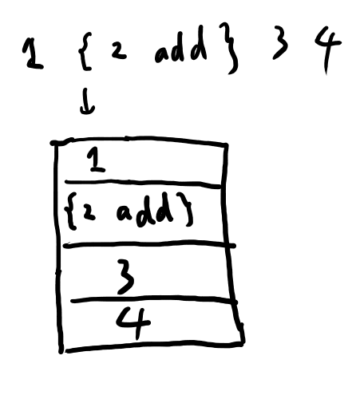
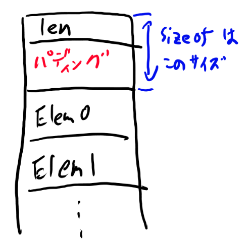
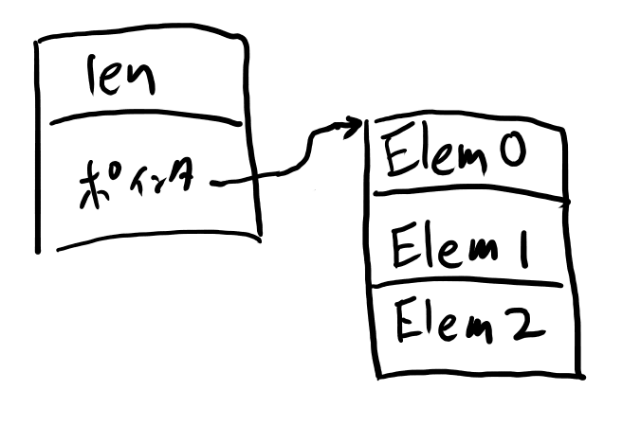
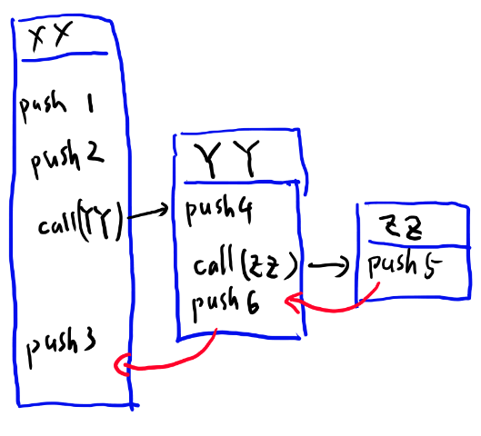

<style>
   .column{
        padding: 0.5em 1em;
        margin: 2em 0;
        color: #5d627b;
        background: white;
        border-top: solid 5px #5d627b;
        box-shadow: 0 3px 5px rgba(0, 0, 0, 0.22);
    }
</style>

# 第一回 簡易PostScriptインタプリタを作ろう

やる事

- ハッシュ、線形リスト、スタックの実装
- 簡単なインタープリタの実装
   - 言語はPost Scriptのサブセット
   - 実行可能配列（関数リテラル相当）、ifelse、repeatくらいまで
- 3000行くらい。

Post Scriptのサブセットを実装してみたいと思います。

最初はForthを実装しようとしたのですが、制御構造の実装がやや面倒なので、
その辺がよりシンプルで美しいPost Scriptに変更します。（その歴史的な理由でフォルダ名などはforth_modokiになっています。すみません）。

Post Scriptは触るとすぐわかるけど説明するとややこしい言語仕様なので、作りながら言語仕様自体の説明はしていきます。
なお、Post Scriptは全く知らなくてもOKです。

### この回の狙い

- ステートマシンの書き方を学ぶ
- 簡単なパーサーの書き方を学ぶ
- 言語の処理系を実装する事でプログラム言語自体の理解を深める
- 基本的なコレクションを実装する
- ファイルの分割とインターフェースを考える事を学ぶ
- そこそこのコードを書く過程で良いコードの書き方を学ぶ
- ついでにスタックマシンも学ぶ


# 01 intのパーサーを作ろう

とりあえずintのパーサーを作る所から始めてみましょう。
初回なので進め方の説明もします。

## githubでの作業の進め方

1. githubのアカウントを作る
2. https://github.com/karino2/c-lesson/ をforkする
3. 自分のc-lessonをローカルにcloneする
4. ローカルで、karino-orignというブランチを作って、remoteにhttps://github.com/karino2/c-lesson.git を指定する
5. 問題は毎回ローカルでブランチを作り、ブランチをgithubにはプッシュする（マスターはいじらない）

こんな感じで作業をしていきましょう。

今回の問題は、01_int_parserというブランチでやるとします。

### int_parserの問題をやってみよう

sources/forth_modoki/01_int_parser/int_parser.c を修正しassertを通るようにしてcommitしてpushしてみて下さい。

初回なのでとりあえず自己紹介くらいのつもりでさらっとお願いします。
scanfは使わないでください（ASCIIから数字への変換を見る目的なので）

# 02 intのパーサーを作ろう（getc編）

01では文字列をパースしました。

パーサーを作る時には、バッファにいったん読み込むか一文字ずつ取るか、という選択が最初にあります。
今回はファイルから一文字ずつ取る（つまりgetcやfgetc相当の物を使う）、という前提でパーサーを書きましょう。

今回はcl_getc()という関数をこちらで用意するのでそれを使ってください。

## パーサーとは何か

intのパーサーではそれほど考える必要もない事ですが、
今後だんだんと複雑にしてくので、ここでパーサーというものについて少し考えてみましょう。

パーサーというのは、PostScriptにおいては、文字を読んで行って、字句、というものに分割するものの事を言います。
字句というのはようするに「種類と値のペア」と思ってだいたい良い。
字句はトークンともいいます。

字句は数字とか記号とかを一単位とします。（以下具体例を見ていく方が分かりやすい）

**パーサーとトークナイザ**  
PostScriptでは字句に分割するとほぼパースが終わるので区別がありませんが、より複雑な言語だと字句に分けるものをトークナイザ、それを文法に従い分類するのをパーサーと言う事があります。  
　  
C言語では古くからトークナイザはlex、トークナイズされた物を文法に合わせて解釈する事をyaccというツールで担当していました。今ではその互換のflexやbisonがそれぞれ標準的に使われていると思います（最近の事情はあまりウォッチしてないので推量で）。
lexは正規表現とその種別のIDを指定しておくと、文字列を読み込んで正規表現に従って字句に切って種別のIDを教えてくれるCコードを生成します。
yaccは（確か）LALR(1)の文法を記述したファイルを渡すと、それに合わせて字句の列を還元してくれるCソースコードを生成します。
lexもyaccもC言語のコードを自動生成してくれるコマンドです。  
　  
ただ個人的にはyaccに相当する物を必要とするような用途は、近年ではC言語の守備範囲より外になったと思っています。
そういった目的ではgolangあたりを使う方が良いでしょう。
また、かつてはこのlex-yaccの組み合わせが定番だったので両者の区別に意味はありましたが、近年は正規表現は言語に標準で組み込まれているのでlex相当の物はあまり出番がなくなりましたし、パーサーコンビネータを始めとする最近のパーサーの仕組みでは、トークナイザとパーサーの区別も曖昧です。  
　  
その辺の事情と昨今のC言語の実態を踏まえて、このシリーズでは以前はトークナイザと呼ばれていた物もパーサーと呼びます。文字列やバイナリを読んでいって何かしらの構造を再構成する物をパーサーと広い意味で呼ぶのは、
2018年現在では適切な表現だと自分は思っています。
{: .column}

### 一回の単位

使い勝手を考えると、一回parse_one()とか呼ぶと、一つ字句が返ってくるのが良い。

"1234 abc"とあったら、一回目のparse_one()では1234という数字を返し、次のparse_one()では' 'を返し、その次のparse_one()では"abc"を返すのが良い。

### 読んでしまった文字をどうするか

パーサーでは、例えば数字をパースするためには数字の一つ先の文字まで読む必要がある。
バッファに読み込んで作業するなら問題ないけれど、今回のようにcl_getc()で一文字ずつ読む場合、数字の次の文字を読んでしまった後に次のparse_one()にどう渡すか、という問題がある。

これはパーサーの性質による所だけど、標準的な文法では、いつも先読みは一文字までで大丈夫になっている。
興味のある人はLALR(1)の文法を調べると良いと思いますが、
今回はそんな難しい事は必要なくて、「一文字だけ先読みを許せばかなりいろんなものがパース出来る」という事だけ知識としてしっておけば良いと思います。

すると最後に読んだ文字、を返すようにし、次の呼び出しの時にそれを渡すようにしないといけない。
また、その文字が無ければ存在しない文字を渡す必要がある。これは'\0'で良いでしょう。


### 途中の場合は今回は考えない

また、パース対象が途中の物がありうるのか？というのもインターフェースを考える時に大切になります。
例えばユーザーが対話的に文字を入力する、というケースでは、
まだ終わってない状態でパースしたい事があるかもしれない。

そういう場合に最後のトークンは本来未確定なので、そこから再開できるようにインターフェースを考えないといけない。

ただ今回は、ハードコードした文字列でもファイルでも、いつも最後まで読み切れる、という前提でコードを書く事にします。

### 呼び出し元に返す必要があるもの

ここまでの話をまとめると、

1. 字句のタイプ
2. 字句の値
3. 読んでしまった次の文字

の三つを返す必要があります。


## 実際の作業手順

次に実際にどう進めるか、という話をしていきます。
最新のレポジトリではsources/02_int_parser_getc/が出来ているので、
この中のint_parser_getc.cを書き換えます。

### gitでfork元の更新を持ってくる

二回目なのでgitの解説を追加しておきましょう。
今回は02_int_parser_getcというブランチで作業する事にします。

まずこれを執筆中の2018/9/23日現在では、ここのサイトと同時に課題となるソースコードも更新している状態です。

そこで前問の状態から私がいろいろ更新しているので、新しく問題を解く時には、私の最新版を取ってきて、そこからブランチを作ります。（後日やる人はこの作業は必要ありません。知識として目を通すくらいで先に進んでください）

まず、karino-originに私の最新版を持ってきます。

```
git checkout karino-origin
git pull
```

次に、masterをkarino-originと同じ状態にします。

```
git checkout master
git merge karino-origin
```

一応github上のmasterを更新しておきます。

```
git push
```

次にこのmasterから今回用のブランチを作ります。

```
git checkout -b 02_int_parser_getc
```

このように、karino-originとmasterはいつも私のレポジトリの最新版と同じにして、
問題を解くときはその時点の最新版のmasterからブランチを作って下さい。

### 作業の進め方

まず字句のタイプを表すenumを作りましょう。NUMBERとSPACEでいいと思います。

次にparse_one関数を作りましょう。
字句の種類と値と先読みしてしまった文字を返す必要があります。

returnで先読みしてしまった文字を返し、字句の種類と値は引数で返しましょう。
返す用の引数はout_という名前にします。例えばint *out_val, int *out_typeなどです。

このparse_oneの型が決まったら一旦enumと合わせてslackで見せて下さい。

次にこのparse_oneを実装して、それを使うコードを書きます。

今回はPost Scriptを実装するので、連続するスペースは一つにしてしまって構いません。
parse_oneを'1  2'とスペースが二つある所に呼んでも、三回目は2を返してください。
二回目の値はスペース一つのフリをする、でOKです。


## Unit Testを書こう

とりあえずparse_oneの実装が出来て動いたら、Unit Testも書けるようにします。
（本来は順番が逆で先にUnit Testを実装するのですが、今回は教える内容の都合でこの順番にしています。）

Unit Testとは成功してるとOKとだけ表示するテストです。
失敗するとどこで失敗したかを表示します。
そして関数一つとか二つとか、なるべく小さい単位のテストを書きます。

細かい書き方はおいおい説明していくとして、まずはUnit Testを書けるようにcl_getc()を拡張しましょう。

### cl_getc()に外部から入力を指定できるようにする

現状はハードコードされたinputを元に順番に文字を返すcl_getc()ですが、
Unit Testの事を考えると外から文字を設定出来る方が望ましいです。

そこで、外部から文字を設定するAPIを足しましょう。

```
void cl_getc_set_src(char* str);
```

とします。これをヘッダファイルに足してcl_get.cの中に実装を書いてください。（posを0にリセットするのを忘れずに！）

これが終わったらいったん見せて下さい。

### 基本的なUnit Testを足そう

それでは次にUnit Testを足します。
テストは最初は"123"という内容に対してparse_oneがどうふるまうべきか、というテストを書いて、mainから呼ぶ事にします。

テストの関数の名前は

```
void test_parse_one_123()
```

としましょう。

mainはこんな感じにします。

```
int main() {
    int answer1 = 0;
    int answer2 = 0;

    // ここから違う

    test_parse_one_123();

    // 入力を元に戻す
    cl_getc_set_src("123 456");

    // 以下は元どおり
    // ...

    // verity result.
    assert(answer1 == 123);
    assert(answer2 == 456);

    return 1;
```

ここまで終わったら一回見せて下さい。

### 空白のあるケースのUnit Testを足そう

次にtest_parse_one_123_456を追加しましょう。"123 456"に対してどう動くか、というテストです。

ちゃんと間の空白もテストしてください。

以後はこのUnit Testで問題を出す事にします。
それを見ながら、Unit Testとはどういう物かをなんとなく学んでいって下さい。

# 03 intとシンボルと特殊文字のパーサーを作ろう

それではここまで書いてきたパーサーを、int以外にも拡張しましょう。
とりあえず、

- 「{」
- 「}」
- 「executable name」
- 「literal name」

の4種類の要素を追加する事にします。

まず最初の二つ、「{」はOPEN_CURLY、「}」はCLOSE_CURLYというenumとしましょう（curly braceで中かっこの意味）。

ここで見かけない言葉が二つありますね。executable nameとliteral nameです。

### Post Scriptの二つのname

nameとはPost Scriptにおける変数名の事です。
abcなどですね。

Post Scriptには二つのnameがあります。
executable nameとliteral nameです。

この二つが何なのかはあとで説明します。
現時点ではパースする対象としてそういう二つがあると思ってください。
パースに必要な事だけここでは説明します。

最初に例を挙げると

**executable name**

- abc
- hello
- x
- abc123

などがexecutable nameです。変数に使われます。

**literal name**

- /abc
- /hello
- /x
- /abc123

などがliteral nameです。スラッシュで始まって、あとはexecutable nameと同じです。

厳密な言い方をするとexecutable nameは、「ローマ字で始まってスペース以外が続く文字で構成された文字列」です。

「literal name」はスラッシュで始まり、そのあとローマ字から始まる文字列です。
ここはPost Scriptはもっと変なものもnameに使えますが、サブセットという事であまり細かい仕様は決めない事にします。


簡単のため、nameは254文字以下としましょう。
255文字以上のnameは来ないものと仮定して、エラー処理などはしなくてOKです。
最初のスラッシュと最後のヌル文字も入れた256をNAME_SIZEとしてdefineしておくので、必要に応じて使ってください。

executable nameは、EXECUTABLE_NAMEというタイプで文字列をmallocして返す事にしましょう。

literal nameはLITERAL_NAMEというタイプで文字列をmallocして返す事にします。
この時、先頭のスラッシュは取り除いてください。

## トークンの型を定義しよう

これまではout_valとout_typeという二つの変数で表していましたが、これを構造体にまとめる事にします。

以下のようにしたいのですが、

```
struct Token {
    enum LexicalType ltype;
    int value;
};
```

ただ今回、valueはintじゃないものも入ります。
具体的には

- int
- 一文字のchar（'{', '}', ' 'のどれか)
- mallocしたchar*へのポインタ

の三つのどれかになります。

charをintに入れるのは仕様上OKなのですが、ポインタは64bit CPUの場合入らない場合があります（C言語の仕様としては入らなくても入ってもOKなので実装依存）。

そこで、これらを全部入れる、unionを定義したいと思います。

### unionを使って複数のトークンのどれかを表す構造体を作る

さて、union。
Cの入門書には必ず書いてあるけど、読んでも構造体との違いが良くわからないものの代表ですね。

ここでまた良く分からないunionの説明を繰り返してもいいのですが、どうせ読んでもなんだか良く分からないと思う。
という事でここでは、実際に使ってみながら勝手に学んでもらう、という方針を取る事にします。

今回は以下のように定義します。

```
struct Token {
    enum LexicalType ltype;
    union {
        int number;
        char onechar;
        char *name;
    } u;
};
```

これをどう使うのか、は、03_parser/parser.cの中のparser_print_all()を読んでみて下さい。

## parse_one()を実装しよう

ここからは、parse_one()とそのUnit Testを実装してもらいます。

今回は私が構造体の定義やparse_one()のシグニチャなどを準備しておきました。
そこでまずは私の書いた内容を理解する事から始めてみてください。

03_parserというブランチを切って作業してください。

### parser_print_all()を読む

まず大きな関数として、parser_print_all()というのがあります。
これはparse_one()を呼び出してトークンをprintする、という事をしています。

この中で、tokenとそのtoken.uがどう使われているかを見る事で、unionの使い方を理解してみてください。

**freeしないの？**  
parser_print_all()は、token.u.nameをfreeしてません。これはメモリリークになります。
長く動き続けるプログラムであればfreeはすべきです。
そうで無い場合にどうするか？というのは意見が割れる所で、C言語においてfreeをすべきかどうかは定期的に論争が発生します。  
　  
このシリーズでは、まぁまぁグローバルに生き残る物や説明上それほど重要でないと思う時もfreeしない事にします。と思って書いて言ったらfreeする場所一箇所も無かった…
この辺は結構適当に決めるので、気になるなら自分でfreeしてくれてもOKです。  
　  
長く動き続ける組み込みのプログラムなどではリークは大問題なのでちゃんと全部解放出来ているのかをすごく時間をかけてチェックしますし、
この忘れは製品の回収騒ぎにまで発展し、結構な被害総額を生む事もあります。
だから組み込みで使われるC言語において、free忘れは重大違反だ…というとそうとも言い切れなく、組み込みで長く動く類のCプログラムはそもそもmalloc自体しない（そういうものが無いなど）という場合も結構あります。  
　  
Unixなどのサーバーで長くデーモンとして動くような物でもメモリリークは大問題となります。ですが、そういう用途でC言語を使う事は随分減りました。
C++であればそもそも手でdeleteを呼ぶのでは無く、スマートポインタなどを使ってスタックに置く方が正しいので、やはりfreeに相当するものを頑張ってチェックする、という機会はあまりありません。  
　  
カーネルの中やドライバなどでは相変わらずfreeし忘れは大問題です。この用途でC言語が使われる事は多く、またmallocに相当するものが必要になるものも結構ありますね。
この辺をやる人の場合は議論の余地なくfreeし忘れは大問題です。  
　  
C言語でどれくらいmallocしたものをfreeしなくてはいけないシチュエーションが多いか、は時代に依る話で、昨今は随分減ったというのが自分の認識です。
リソースの管理として終了が必要なものはあるのだから最初からしっかりクセをつけるべきだ、というのも一理あると思いますが、そこから先は宗教戦争になるので読者の皆様が好きにしたら良いでしょう。
{: .column}

### 二つのUnit Testを読む

次にUnit Testが二つだけ用意されています。
この二つを読んでみてください。
test_parse_one_number()は前回書いてもらった物とほとんど変わらないので、読めばわかると思います。

test_parse_one_empty_should_return_END_OF_FILE()は前回あまり明確に決まりを作らなかった、
空っぽのファイルを読ませたらどうふるまうべきか？という事についてのテストです。
今回は最後まで読んだ後にparse_one()を読んだら、END_OF_FILEというタイプを返すべき、という事に決めようと思います。


### まずはUnit Testを通すだけのparse_oneを実装する

既に書かれているコードの内容を理解したら、まずmainのparser_print_all()をコメントアウトし、
Unit Testを通す事から始めます。
前回とほとんと同じ内容となるので、前回のコードからコピペしてきて書いて下さい。

ここまで終わったら一度私に見せてください。

### executable nameのテストを足して実装しよう

executable nameは、ローマ字で始まって空白以外が続く文字としましょう。
テストとしては、以下で始めてください。

```
char* input = "add";
char* expect_name = "add";
int expect_type = EXECUTABLE_NAME
```

テストが追加出来たらparse_oneを実装する前に一回このテストがfailする事を確認します。

そのあとにparse_oneを実装してください。

### literal nameのテストを足して実装しよう

executable nameとほとんど同じですが、literal nameはスラッシュ、つまり'/'から始まる、という所が違います。

テストとしては、

```
char* input = "/add";
char* expect_name = "add";
int expect_type = LITERAL_NAME
```

としましょう。expect_nameにスラッシュが無い事に注意してください。

このテストもfailするのを確認してからparse_oneを実装してください。

### 中括弧も実装しよう

以下同様にOPEN_CURLYとCLOSE_CURLYも実装してください。
全部が終わったら、最後にparser_print_allを実行してみて動く事を確認してください。

動かなかったら必ずその理由を明らかにするUnit Testを追加してから直しましょう。


# 04 スタックを作ろう

数字とリテラルネームを出し入れ出来るスタックを作りましょう。

stack.cとstack.hというファイルに実装し、stack_push, stack_popという関数と、
stack_print_allを作って下さい。

スタックサイズは

```
#define STACK_SIZE 1024
```

くらいでお願いします。

ブランチ名は04_stackでお願いします。

### まずインターフェースを決める

まず04_stackというディレクトリを作って、その中で作業してください。
今回はファイルから全部自分で作って下さい。ブランチもこれまで同様作ってください。

スタックには数字とリテラルネームの二つをpushしたりpopしたり出来る必要があります。

とりあえずstack_push()、stack_pop()の型が決まったらいったん見せて下さい。

### 次にUnit Testを書く

何もないときにpop呼んだ時、一つpushしたとき、一つpushしてpopした時、二つpushしてpop二回した時の内容をそれぞれチェックする位のテストを書いて見せて下さい。
なお、テストを書くのにstack_push()とstack_pop()以外が必要になったら適宜追加してください。

そのあとはそれを実装します。

なるべく、一度でテスト一つずつ通すように実装を進めます。

まず何もない時にpop呼んだ時のテストを通るだけのコードを書き、
次に一つだけpushがちゃんと動くように張りぼてっぽいものを書き、次に二つのpushが動くちゃんとした実装に直す、という具合です。


# 05 addだけのevalループを作ろう

ここまでパーサーとスタックを作ったので、PostScriptのコアとなるevalを書く事が出来るようになりました。
これを実装していきましょう。

## PostScript入門

まずevalを作るにあたり、今更ですが、そろそろPostScript自体の話をしていきましょう。
なお、GhostScriptという物が入っている環境がある場合、gsというコマンドで対話的インタプリタが立ち上がっていろいろ試す事が出来ます。

### 数字だったらpush

まずPostScriptにはスタックというものがグローバルに一つあります。
で、プログラムは空白区切りでテキストを区切って読んで行って、
数字だったらこのスタックにpushします。

だから、

```
1 2 3
```

と書いてあったら、スタックに1をpushし、次に2をpushし、次に3をpushします。

### 文字の単語なら関数と思って実行

addとかsubとかにぶつかると、関数呼び出しと思って実行します。

addというのは、スタックから二つ数字を取り出して足し算して結果をスタックに積みます。
だから、

```
1 2 add
```

と書いてあるとインタープリタは先頭から読んでいって、

1. まず最初に「1」を読んでスタックにプッシュします。
2. 次に「2」を読んでスタックにプッシュします。
3. 次に「add」を読んだら、これは数字じゃないので関数だと思ってaddを実行します。

addを実行すると何が起こるかはaddという関数の仕様という事になります。
PostScriptでは関数と呼ばず実行可能ネームと呼びますが、ここでは関数と言ってしまいます。なお余談ですが、親戚にあたるForthでは実行可能ワードと呼びます。

addは

- スタックから2つ値を取り出して
- それを足して
- 結果をプッシュする

という振る舞いをします。スタックにはこの場合1と2が入っているので、これを取り出すと、
スタックは空になります。
次に1+2を計算して、結果をスタックにプッシュするので、最終的には3が入ります。
疑似コードで書くと以下みたいな振る舞いです。

```
var a = pop();
var b = pop();
push(a+b);
```

以上を踏まえると以下のコードは何が起こるでしょうか？

```
1 2 3 add
```

答えだけ言うと、スタックには1と5が残ります。1が残る理由は分かるでしょうか？

```
1 2 add 3 add 4 add 5 add
```

と、

```
1 2 3 4 5 add add add add
```

は同じ結果になります（たぶん）。

3+2*(2+1)+4なら、

```
3 2 2 1 add mul add 4 add
```

とか書けます。数式からPostScriptに直すのは慣れればすぐ出来ますが、
PostScriptのコードから数式に戻すのはちょっと脳への負荷がありますね。

以後、必要になる都度他の要素は解説していきます。


### 外部サイト

必要な事は適宜解説していくつもりですが、ちゃんと一気に学びたい、というなら、
以下のサイトなどで学ぶと良いと思います。
PostScriptはすごくシンプルな言語仕様なので、他のプログラム言語の経験があれば主要な機能は10分くらいで学ぶ事が出来ると思います。凄い。

ただ言語の性質上、プログラム言語以外の解説が多いので手頃な解説が少ないという難点があります。

- [PostScript 基礎文法最速マスター](http://d.hatena.ne.jp/dayflower/20100203/1265185183)  
言語自体の解説として割と良いが、実行可能配列の解説が後ろの方なのがこのシリーズ的には惜しい。
- [PostScript Language Tutorial & Cookbook(pdf)](https://www-cdf.fnal.gov/offline/PostScript/BLUEBOOK.PDF)  
いわゆるBlue Book。例がプリンタ周りの事が多いので名前ほど入門向けでは無いけれど、最後のBuilt-inのプリミティブの一覧が便利。
- [PostScript Language Program Design (pdf)](https://www-cdf.fnal.gov/offline/PostScript/GREENBK.PDF)  
いわゆるGreen Book。英語が読めるならこの2.3から2章の終わりまでを読むのも良い。ただしプリミティブの説明は無いのでBlue Bookの最後と併用する。

## 今回実装する事

以上を踏まえて、とりあえずaddが動くようにしましょう。subやmulも実装してもいいんですが、
後で書き直す事になるのでやめておきます。

```
3 4 add
```

や、

```
3 7 add 5 add
```

などが動くようにevalループを書きましょう。

最後にスタックの中身が空じゃなかったら、その中身を出力するようにしておきます。

### まず前の課題から、パーサーとスタックを持って来よう

05_evalのディレクトリの中を実装していきますが、パーサーとスタックは自分が作ったものを持ってきて下さい。
別のブランチで作った物をどう持ってくるのか？という問題があるかもしれませんが、いったん別のディレクトリにcpするとかの原始的な方法でOKです。
（わからなかったらslackで聞いて下さい）

main関数は#if 0でコメントアウトしておいて下さい。

スタックのインターフェースをどうしたかが人に依るので、eval.cのUnit Testでスタックの中をチェックするコードは書いてません。
そこも書いてまずはリンクを通してテストがfailするのを確認します。

### 数字をスタックにプッシュするだけのテストを通そう

evalはparse_one()を呼んで、その中に応じて処理をswitchする感じになります。
03_parserで最初にparser.cに書いてあった、parser_print_all()を参考にしてみてください。
数字だったらpushする、は比較的簡単だと思います。

### 次にaddの処理をハードコードしよう

数字は比較的簡単と思います。
次はEXECUTABLE_NAMEですが、まずは

```
int streq(char *s1, char *s2);
```

という関数をstrcmpあたりを使って作ってください。イコールなら1、違ってたら0を返す感じです。

次に、nameが"add"だったら、スタックから二つ値をpopして足した結果をpushする、というコードを普通に書いてしまいましょう。
これでUnit Testは通るはずです。

将来的には関数ポインタなどを使う事になりますが、現時点ではここまでで次に進みましょう。


### 最小限のインタープリタが完成！

ここまで来ると、インタープリタとして最小限の機能が通る事になります。
cl_getc()をファイルから読み込むように直すのは簡単でしょう。(あとでやるのでまだやらなくてもOKです)

まだ足し算しか出来ませんが、それでもパースしてevalする、
インタープリタのコアとなる骨組みは出来た事になります。

ここまででも、結構複雑なプログラムを動かす事が出来ます。
例えば

```
1 2 3 add add 4 5 6 7 8 9 add add add add add
```

とかやると、たぶん動くでしょう。ゆとりなので答えが幾つになるか知りませんが、なんか出ると思います（55だっけ？）。
やろうと思えばmulやsubやdivも実装は出来るでしょう（ですがこの辺は後でハッシュ実装したあとの方が都合が良いのでここではまだ実装しなくてOKです）。

インタープリタは実装した物がそのまま動く普通のプログラムと違って、
食わせたコードが動くので、実装した時点では考えてない振る舞いをさせる事が出来る所に、
ちょっとなんかソフトウェアを作った、って感じがしますよね（著者個人の感想です）。

とは言ってもこれではifもループも関数定義も無いので、まだまだインタープリタと他人に自慢出来る程ではありませんね。
という事で関数を作っていくべく、次はdefの実装に移りましょう。


# 06 原始的な辞書を作り、literal nameにdef出来るようにしよう

```
/hoge 123 def
```

としたら、以後

```
hoge
```

とすると123と書いたのと同じになるようにしましょう。
ここからは前回の05_evalに追加していく形で作業したいのですが、名前が05だとややこしいので、
interpreterというディレクトリを作り、ここに前回の05_evalをすべてコピーして、
以後このinterpreterというディレクトリで作業していきましょう。

前回の最後の状態から、新たに06_literal_nameというブランチを作り、そこで作業していってください。


### literal nameをスタックにプッシュしよう

まず、リテラルネームはスタックにプッシュするようにevalを書き換えましょう。
ここからはnameをリークさせるかちゃんと解放するかで結構コードが変わって来ますが、
今後は一度mallocした文字列は解放しない、という前提で書いて行きます。
勉強目的ですしね。

さて、解放を考えないなら、literal nameをpushするのはintとほとんど変わらないと思います。
intの変わりにポインタを入れて、さらにタイプとしてliteral nameを表すenumを入れればいいだけでしょう。


**解放したいならリファレンスカウントがオススメ**  
勉強目的ではリークする方がオススメですし、実際に使う時もリークで構わない事がほとんどだと思います。例えば真面目にVMを作る時も、そもそもコンスタントな文字列の扱いはmallocで別々に取ったりせずにコンスタントプール的なものをちゃんと作る事になりますし、
一見するほどこの手のコードでちゃんとfreeしなくてはいけないシチュエーションは多くはありません。  
　  
ですが、もし真面目にfreeしてみよう、と思ったら、いちいち必要に応じてmallocしたりfreeしたりを繰り返すよりも、リファレンスカウントを実装するのが簡単でオススメです。
循環参照でリークするのは皆の知る通りですが、PostScriptでそれが発生するのは稀なので、昔のJavaScriptのリークほどひどい事にはなりません。  
　  
リファレンスカウントを実装するなら構造体に文字列ポインタの他にref_countみたいな変数を持たせて、mallocした時に1にし、以後スタックにコピーする時などには+1し、スタックからポップする時やparse_oneで得た構造体が要らなくなった時などには-1します。0になったらフリーします。
リファレンスカウントを使ってリーク無くコードを書く方法にはCOMなどで長い歴史があり、
結論とでも言うべきルールも出来上がっています。これを参考にするのが良いでしょう。
英語だと例えば[MSDN:The Rules of the Component Object Model](https://msdn.microsoft.com/en-us/library/ms810016.aspx)の「Reference-Counting Rules」に記述があります。  
　  
実装は簡単な割には動いているのを確認してリークなくしたりしていくのはまぁまぁ楽しいので、趣味として一回くらいやってみても良いと思います。
ただし、そこまでやるならC言語以外の選択肢を検討するタイミングかな、と個人的には思いますね。 C++ならshared_ptrとかありますしね。
{: .column}

## defを実装する

今回は数値だけのdefを実装します。
defはちょっと難しいので少し丁寧に説明します。

### そもそもdefとはどんなものか？

defはスタックのtopから二番目に入ってるリテラルネームに、topの値を束縛します。

コードの例を見てみましょう。

```
/hoge 123 def
```

これは、他の言語でいう、例えば

```
var hoge = 123;
```

とかと同じような意味です。
以後はこのhogeを、

```
hoge 2 add
```

とかいう風に、まるで123という数字のように使えます。

defは必ずスタックの二番目にリテラルネームが入っている、という前提で機能します。
入ってない時はprintfでそのむね出力して、あとは好きにして下さい。（無視して動いてもexitで終わってもOK)。

### まずは辞書のAPIを考える

defを実装する為には、変数で値をルックアップ出来る何かが必要になります。
他の言語では辞書を使う所ですね。
そこでここでは、まず辞書のAPIを考えて、一番単純だが遅い実装から始めます。

辞書としては、スタックと同じ要素が入れられればいいでしょう。
スタックの時の構造体を使ってください。
ここではそれが

```
struct Element {
    ...
}
```

という名前の構造体だったとして解説を書きます。（別に違う名前で構いません。説明の都合です）

すると辞書のAPIとしては、

```
void dict_put(char* key, struct Element *elem);
int dict_get(char* key, struct Element *out_elem);
void dict_print_all();
```

の三つくらいがあれば良いでしょう。dict_getは、キーが無ければ0を、キーがあれば1を返すとします。

### 最初の実装：配列に入れて、ひたすらstreq

最初は、一番頭を使わない実装でいきましょう。
以下のような配列を使って、先頭から順番に入れていく、という実装にします。

```
static int dict_pos = 0;
struct KeyValue {
    char *key;
    struct Element value;
}
static sturct KeyValue dict_array[1024];
```

dict_putは以下のような感じで実装します。

```
void dict_put(char* key, struct Element *elem) {
    if(すでにキーがdict_arrayに入ってたら) {
        dict_arrayのその場所をelemで上書き;
    } else {
        dict_array[dict_pos] = KeyValue(key, elem);
        dict_pos++;
    }
}
```

もちろんこれは疑似コードなので、これをC言語に翻訳してください。

同じ変数に二回defした時に、ちゃんと前の変数を上書きするように気をつける、という事以外は、
別に注意すべき事も無いでしょう。

1024回よりもputされたら配列があふれますが、その時のコードは書かなくていいです（どうせすぐ書き直すコードなので）。

dict_get()は、

```
int dict_get(char *key, struct Element *out_elem) {
    for(int i = 0; i < dict_pos; i++) {
        if(streq(key, dict_array[i].key)) {
            out_elemに結果を詰める。
            return 1;
        }
    }
    return 0;
}
```

という感じにします。
ただ、dict_putの所でこのiに相当するものが必要になると思うので、その辺はちゃんと書き直してください。

これに簡単なテストも書いて実装してみてください。

### defを実装しよう

これが実装出来たら、次はdefを実装します。
例として、

```
/abc 12 def
```

というコードを考えましょう。
defが呼ばれる時点では、スタックには「/abc 12」の2つの要素が入っています。

そこで疑似コードで書くと以下のような事をします。

```
int val = pop();
char* literal_name = pop();
dict_push(literal_name, val);
```

これに相当する事をC言語でちゃんと実装してください。

### eval時に、定義された変数が出てきたら、中身に置き換えるコードを書く

ここまででdefが実装出来た事になるのですが、これだと変数への代入相当だけが実装出来ただけで、
変数を「使う」コードが入っていません。そこで次にそれを実装します。

eval()のEXECUTABLE_NAMEの所で、辞書にそのnameが入っていたら、中身に置き換える、という処理をやります。
疑似コードで書くと以下のような感じです。


```
if(tokenがEXECUTABLE_NAME) {
   if(streq("add", name)) {
       ....
   } else if(streq("def", name)) {
      ....
   } else if(nameがdictに入っていたら) {
      int val = dict_get(name);
      stack_push(val);
   }

}

```

こんな感じのコードになります。

これで、以下のようなコードが動くようになりました。

```
/abc 12 def
abc abc
```

ここまでで一旦コードをpushして私に見せてください。

# 07 辞書の実装をハッシュテーブルに置き換えよう

さて、前回作った辞書。
おもちゃならあの実装でも十分ですが、少し効率が悪い。
というのも、dict_getでstreqをエントリの数だけ実行する事になるからです。

そこで次に、勉強の目的も兼ねて、もっと普通の実装に改善してみましょう。

普通は辞書の実装には、二分木（及びその改良版のバランスドツリー）かハッシュテーブルを使います。
今回はハッシュテーブルを実装する事にしましょう。

なお、以下の作業を始める前にちゃんと上の単純な実装でUnit Testを書いて、動く事を確認しておいて下さい。(ハッシュテーブルはバグりがちなので、テストをある程度書いてから書く方が良い）。

### ハッシュテーブルの基本

ハッシュテーブルは文字をキーにして値を保存するデータ構造です。

実装としては「ハッシュ関数＋配列＋線形リスト」で構成されます。
まず配列には線形リストの先頭が入ります。


説明の為、保存する値はintだけとし、以下のようなコードを前提に考えます。

```
struct Node {
    char *key;
    int value;
    struct Node *next;
};

struct Node *array[1024];
```

実際に実装する時には1024はTABLE_SIZEとかマクロで定義しておいて下さい。

ある文字列を与えると、その文字列を0から1023のどれかの数字に割り当てる関数を用意して、
その配列から始まる線形リストのどこかに入れます。

どうやって0から1023の数字を生成するかはどうでもいいのですが、

1. なるべくバラける事
2. 同じ文字を入れたらいつも同じ数値になる事

の2つの条件を満たしている必要があります。
この文字から0から1023のどれかの数値を計算する関数がハッシュ関数です。

### 簡単なハッシュ関数の実装例

ここでは簡単なハッシュ関数として、「全ASCIIコードを足して1024で割った余り」をハッシュ関数としましょう。
あまりはC言語ではパーセントで計算出来ます。つまり以下のような感じになります。


```
int hash(char *str) {
   unsigned int val = 0;
   while(*str) {
       val += *str++;
   }
   return (int)(val%1024);
}
```

この実装だと、ASCIIコードはだいたい70とかその辺の数字なので、3文字くらいでは210とか小さめのキーばかりが返ってくる為、あまり良いハッシュ関数ではありません。
ただ、簡単に実装出来るので今回はこれでいきたいと思います。
改善案としては、適当なランダムな数字、例えば179025684622をこのvalだけ右にビットローテートして1024で割る、とか、一文字足すごとに7777倍するとかいろいろ考えられますが、今回はやりません。

### ハッシュ関数を使ったdict_push()の擬似コード

さて、こうして得られたarray[hash(key)]をリストのheadとして、あとは普通の線形リストのコードとなります。
dict_put()の場合なら、


```
void dict_put(char* key, int value) {
    int idx = hash(key);
    struct Node *head = array[idx];
    if(head == nul) {
       headをallocする
       head->next = NULL;
       headのkeyとvalueをセット;
       array[idx] = head;
       return;
    }
    update_or_insert_list(head, key, value);
}
```

みたいな実装になります。update_or_insert_list()は通常の線形リストと同じ実装で、
すでにkeyのnodeがあったらそのvalueを上書き、なければ新しくnodeをつくって末尾に追加します。
線形リストは世の中にたくさん解説があると思うのでここでは解説しません。ググってみるなり本を読むなりしてください。（誰か良いサイトとか知ってたら教えてください。ここにリンク貼ります）

こういう風に

1. hash関数で文字列から配列のindexを得る
2. 配列から線形リストの先頭を得る
3. 線形リストをたどってkeyと同じノードを探す

という三段階の作業をするのがハッシュテーブルです。


### 実際に実装してみよう

ではすでに実装してあったdict_push()とdict_get()をハッシュテーブルで実装しなおしてみましょう。
正しく実装すればさきほど書いてあったUnit Testが全部通るはずです。

普通ハッシュテーブルはあまり衝突しないくらい大きめの配列でやるのですが、今回は勉強も兼ねてある程度衝突するようにTABLE_SIZEは16でやってみましょうか（ASCIIコードを考えて衝突するテストケースも作ってみてください。その場合はハッシュ関数などのアルゴリズムに依存してる事をコメントするように）。

ここまででdefの基本的実装が終わりました。

**PostScriptの辞書を実装したいなら**  
PostScriptではコレクションとして辞書を作って使う事が出来ます。
JavaScriptやPythonと同じですね。  
　  
今回のシリーズではやりませんが、もしこれを実装したいなら、今回作ったハッシュテーブルの辞書を少し変更するだけで実装出来ます。
現状の実装だとarrayをグローバル変数で持っているのですが、これをmallocで取るように変えて、幾つも辞書を作れるように変更するだけです。  
　  
辞書はPostScriptでは他の言語で言うローカル変数を実現する為にも使えます。
今回辞書を少し真面目にハッシュテーブルで実装した背景には、
PostScriptの辞書をサポートしたくなったらちょっとの変更で出来る程度には仕組みを理解しておこう、という気持ちがあったりします。
{: .column}


# 08 プリミティブを辞書に登録しよう

ユーザーが定義したものではない、処理系から最初から入っている関数などを「プリミティブ」と呼びます。
addとかdefとかの事です。Built-inと呼ぶ事もあります。

現状はevalの中でハードコードされていますが、
これではsubやmulなどを追加していくと、evalがどんどん読みにくくなってしまいます。
そこでこれらのプリミティブを追加してもevalのコードに影響がないように変更しましょう。

その為には、前回実装したユーザー定義のexecutable nameと似たような感じでaddやdefも扱います。

## 関数ポインタの話

プリミティブを登録するには、関数ポインタを登録する必要があります。
関数ポインタはC言語の入門書を読んだだけだとちょっと不安がある項目だと思うので、簡単にここで解説しておきます。


### 関数ポインタはシンタックスがややこしいだけ

関数ポインタは、C言語において関数を変数に入れる方法です。
といっても最近の言語を経験した人からすると、関数を変数に入れて渡したり出来るのはむしろ当然でしょう。
実際Pythonなどでは普通に変数に入れてよそに渡したり出来ます。

そこで最近の言語から入った人にとっては関数ポインタは、

1. 名前が難しそう
2. シンタックスが変

という2つを克服すれば良いだけの、割とちょろい話です。
1は「関数ポインタ」という言葉には大した意味が無いと思ってもらえば十分です。

という訳でここでは2の話をしておきます。

C言語では、関数の宣言で、名前の所をカッコでくくってアスタリスクをつけると関数ポインタの宣言となります。

例えば普通の関数が、

```
int hoge(int a, int b);
```

という宣言だった場合、この型と同じ型の関数ポインタは

```
int (*hoge)(int a, int b);
```

で宣言出来ます。
hogeを(*hoge)にすると関数ポインタになる訳ですが、ややこしいのはこのhogeが変数名になる事です。

比較の為に、普通のintのポインタ変数と並べてみましょう。

```
// intのポインタ変数
int* hoge;

// 関数ポインタのポインタ変数
int (*hoge)(int a, int b);
```

つまり、int (*hoge)(int a, int b)はhogeという変数を作るのです。

この変数に関数の関数ポインタを代入する事が出来ます。
例えば、以下のような関数があった時に、

```
int ika(int a, int b);
```

この関数を先程の関数ポインタの変数に代入出来ます。

```
hoge = ika;
```

このように、変数hogeに代入出来る訳です。
代入した関数ポインタは、普通にカッコをつけて呼ぶ事が出来ます。

```
hoge(3, 4);
```

関数ポインタといいつつ代入する時にアンパサンドが要らなかったり、呼ぶ時にアスタリスクが要らなかったりしますが、
いろいろ理屈をこじつけるよりは、C言語はこの辺いい加減だから、と割り切って覚えてしまう方が良いでしょう。

### 辞書に関数ポインタを代入する場合

さて、我々の目的としては、addやdefの処理をする所を関数に分離して、
その関数を辞書に入れたい。
辞書にはElementという構造体を入れるとして、enumとして種類をつけているとします。

C言語の関数の種類を足して、unionにフィールドを足せば辞書に入れられそうです。

まずはenumはELEMENT_C_FUNCという名前としましょうか。
そしてunionは、以下のようになります。


```
enum ElementType {
...
ELEMENT_C_FUNC
};

struct Element {
    enum ElementType etype;
    union {
        ...
        void (*cfunc)();
    } u;
};

```

これに代入する場合は、

```
elem.u.cfunc = add;
```

などのようになります。
呼ぶ場合は以下のようになります。

```
elem.u.cfunc();
```

関数ポインタも使っていくと分かる類の事だと思うので、この位の説明でとりあえずやってみて下さい。


## addを辞書に登録しよう

では試しにaddを関数ポインタにして辞書に登録し、evalから抜き出してみましょう。
以下の手順になります。

1. addを単体の関数にする
2. 辞書のElemに関数ポインタも追加出来るようにenumなどを追加
3. evalでElementの型を見てC関数なら呼ぶ
4. mainでaddを辞書に入れる

順番に見ていきましょう。


### 1. addを単体の関数にする

すでになっていればいいのですが、現状はevalの中に埋め込まれいてる人もいると思います。
疑似コードで書くと、eval()の中に以下のような意味のコードがあるんじゃないでしょうか。
(C言語なのでstack_pop()はもっと複雑なはずです。あくまで擬似コードで)

```
if(tokenがEXECUTABLE_NAMEなら) {
    if(token.u.nameが"add"なら) {
       int a = stack_pop();
       int b = stack_pop();
       stack_push(a+b);
    } else if(token.u.nameが"def"なら){
       ...
    } else {
       // ユーザー定義のname。辞書からnumberを取り出してスタックにプッシュ
       ...
    } 
}
```

まず、この"add"の時のif文の中を関数にします。

```
void add_op(){
   int a = stack_pop();
   int b = stack_pop();
   stack_push(a+b);  
}

// evalの中
if(tokenがEXECUTABLE_NAMEなら) {
    if(token.u.nameが"add"なら) {
      add_op();
    } else if(token.u.nameが"def"なら){
       ...
    } else {
       // ユーザー定義のname。辞書からnumberを取り出してスタックにプッシュ
       ...
    } 
}

```

こうしてadd_opという関数を出来たら、次に辞書にこれを登録出来るように辞書の方を拡張します。
それは先程関数ポインタの方で軽く説明してあるので自力でやってみてください。


### 3 evalでElementの型を見てC関数なら呼ぶ

先程のevalの所のコードで、EXECUTABLE_NAMEの所の処理に、ELEMENT_C_FUNCTIONの時の処理を追加します。
疑似コードで書くとだいたい以下のようになるでしょう。

```
// evalの中
if(tokenがEXECUTABLE_NAMEなら) {
    if(token.u.nameが"def"なら){
       ...
    } else {
       // ユーザー定義のnameかプリミティブ。
       struct Element elem = dict_get(token.u.name)

       if(elem.etype == ELEMENT_C_FUNCTION){
         elem.u.cfunc();
       } else {
         //ユーザー定義のname。辞書からnumberを取り出してスタックにプッシュ
       }
       ...
    } 
}

```

これであとはadd_opを辞書に登録するだけです。


### 4 mainの先頭の方で関数を辞書に登録

疑似コードで言うと以下のようなコードを書いて、mainから呼んで下さい。

```
void register_primitives() {
   dict_push(add_op);
}
```

これで今までのテストが全て通るはずです。試しに実行してみてください。

### そのほかのprimitiveもこの形に直す

addが無事動いたら、primitiveを増やす時です。
まずはdefも関数として登録してください。

それが終わったらsub, mul, divも実装してみましょう。
今回は小数は出したくないので、divは整数の割り算であまりは切り捨てて下さい。

subはどっちからどっち引くのかがわかりにくいので書いておくと、以下のコードは2がスタックに置かれるのが期待値です。

```
5 3 sub
```


# 09 実行可能配列を実装しよう（ここが大変）

他の言語で言うと所のラムダ式とか関数リテラルと呼ばれる物を、PostScriptでは実行可能配列と言います。
実行可能配列はPostScriptの中心となる仕組みで、制御構造などのブロックとして使われたり、
変数に代入して関数として使われたりします。

ここではこの実行可能配列を実装してみましょう。

## PostScriptにおける実行可能配列

まずは実装する実行可能配列というのがどういう物かを見ていきます。

### まずは具体例

まず例としては、以下のようなコードが挙げられます。

```
/onetwo {1 2} def
```

このようにしたら、以後onetwoと書くと 1 2と書いたのと同じになります。

また、例えば以下のように書くと

```
/plusone { 1 add } def
```

以後 plusone と書いたら 1 add と書いたのと同じになります。

### 具体的な振る舞い

実行可能配列は、中括弧で始まって中括弧閉じで終わる物です。
間にはPostScriptのコードが書かれますが、evalされた時点ではこの中のコードは実行されません。

中の命令列をそのまま保持したまま、数字などと同様にスタックにプッシュされます。



この実行可能配列を実行する方法は幾つかありますが、
一番簡単なのは変数に代入して、その変数を評価すると実行出来ます。

つまり

```
/add3 { 3 add } def
```

という風にadd3という変数に入れて、これを


```
4 add3
```

というふうに実行する訳です。こうするとスタックには7が入ります。

つまり実行可能配列とは

1. 開き中括弧で始まり閉じ中括弧で終わる
2. 間にはPostScriptのコードが並ぶが、実行はその場ではされず、そのまま保持された状態でコード片のままスタックに積まれる
3. 後で変数などを通して評価されると実行される

という物です。
実行の所はあとでifやrepeatが出てくるともう少し具体的な例が出せるので、まずは変数に代入して変数を評価するパターンだけを考えましょう。

## 具体的な実装の話

実行可能配列という物がどういう物かはなんとなくわかったので、次に実装方法を考えます。
まずは実装の選択肢から見ていき、その後注意すべき所を説明します。

### 実装方法の選択肢

ここは何種類かやり方が考えられる所です。

1. 中括弧の中を文字列でそのまま持っておいて、実行したくなったら文字列をevalする
2. パースしたトークン列をそのまま持っておいて、実行したくなったらこのトークン列をevalする
3. （簡易）バイトコードの配列に変換して持っておいて、実行したくなったらバイトコードを実行する
4. JITして関数ポインタにしておいて、プリミティブと同じように実行する

1はevalの実装はほとんどそのままで良いので簡単ですが、パーサーをいじって文字を返すようにしないといけません。
中括弧はネストする可能性があるので、ちょっとしたステートマシーンにする必要があります。
今回は文字列を扱いませんが、文字列も扱うと文字列の中に中括弧が出てくる場合もあるので、より難しくなります。
ただ全体的にはかなり簡単な実装方法と言えます。

2はパーサー自体はほとんどいじらなくても良く、evalもトークンを得る所だけちょっと細工すれば良いので、それほど難しい事はありません。
これが一番簡単かな？

3は論理的には結構2と違うのですが、実装してみると2とかなり似た物になります。
もともとPost Scriptは言語がバイトコードに近いので、違いは中括弧が無くなるのと、ネストしている時に初回のeval時の処理がネストするくらいです（それが大違いなのですが）。
概念的にはこれはスクリプト言語をコンパイルしてバイトコードを生成する事になります。

4のJITはさらに本格的にした物ですね。これはmallocした領域にコードを書いて関数ポインタにキャストして呼ぶ事になりますが、実行可能ビットを立てるなどCPUやOSによっては追加で必要な作業が出てきます。
また、走らせる環境のマシン語の知識が必要となります。
今回の内容からすれば無駄に複雑な話なので却下で良いのですが、GCとかJITのようなより高度な機能を勉強したい時に、PostScriptはコアがシンプルなので簡単に追加出来て勉強に向いていると思います。

今回はあえてちょっと難しい3でやってみましょう。
バイトコードにコンパイルする、厨2魂を満足させてくれる響きだ。(著者個人の見解です)

### 簡易バイトコードのデータ構造

バイトコードはPostScriptの命令を表す要素の配列です。
一番簡単な物としては、パーサーが返すTokenか、スタックや辞書が扱うElementを使う事でしょう。

ここではバイトコードはElementの配列としましょう。
これまでexecutable nameがElementには無かったと思いますが、
バイトコードにする為にはexecutable nameも必要になるので追加しておきます。

実行可能配列のオブジェクト自体もElementに追加しましょう。
ここで問題になるのがElementの配列をどう保持するか、です。

通常C言語では配列の先頭のポインタを配列として保持します。
ですがこれだけでは長さが分かりません。
そこでどうにか長さを知らせる必要があります。

選択肢は幾つか考えられますが、良くあるのは以下くらいでしょうか。

1. 終わりを表す特殊なElementを最後の印とする
2. 先頭に長さを埋め込む
3. unionの中にstructをネストしてintの長さを表すフィールドも作る
4. ポインタのポインタにして最後をNULLにしておく

1と2が良くある気がします。
1は番兵とかセンチネルとか言われる物ですね。これでもいいかな、と思いますが、
今回は勉強の為に2で行こうと思います。
以下2以外の解説をしておきます。

4は要素自身が文字列などの可変長の場合は良くありますが、今回みたいなケースではあまりありませんね。

3は、unionは最大の要素のサイズがいつも使われるので、3を選んでしまうとバイトコートのサイズが膨れてしまいます。
1と2ならenumが1バイトの、32bitマシンならポインタやintが4バイトなので一命令5バイトですが、
選択肢3を使うと1+4+4で一命令9バイトになります。(細かい事を言うとメモリ上ではパディングがあるのでもっと大きいですが)。

このシリーズのここまでのノリなら9バイトでも別にいいじゃん、という気もしますが、普通は3は無いかなぁ。

一応選択肢3のコードを簡単に書いておくと、以下のようなコードです。

```
struct Element {
   enum ElementType etype;
   union {
     ...
     struct {
       Element *byte_codes;
       int len;
     } exec_array;
   } u;
};
```

今回はC言語の勉強という事なので良くある定石を学ぶという意味でも2でやってみましょう。
以下2のやりかたについて説明していきます。


## flexible arrayを使って連続領域に長さと構造体の配列を埋め込む

C言語では配列の長さが実行時にしかわからなかったり、インスタンスごとに変わる場合には、
以下のように構造体の最後に配列をサイズ0で埋め込むのがイディオムとなっています（なお、古いコンパイラ向けにサイズを1にしているコードも見かけるかもしれません）。

```
struct ElementArray {
   int len;
   struct Element elements[0];
];
```

この長さが0の配列宣言は特殊な意味があって、sizoeofの時にはこのElement型の配列の直前までのサイズとなります。(「確保の仕組み」の所の図参照）。
この長さが0の配列をflexible arrayと言います。

こうして、確保する時には配列の領域も足して確保します。例えば要素が3つの場合は以下のように確保します。

```
struct ElementArray *arr = (struct EelementArray*)malloc(sizeof(struct ElementArray)+sizeof(struct Element)*3);
```

構造体の型としてはarr->elements[1]などとするとエラーになりそうな物ですが、
C言語は確保した領域さえあれば実行時に宣言した時より先の所に触っても文句を言わないので、
問題ありません（仕様上はflexible arrayじゃない場合は宣言より先のアクセス動作は未定義らしいですが、駄目なコンパイラは自分は見た事無いし、何にせよflexible arrayなら問題無い事が保証されています）。

そこでこうやって先頭に長さを持たせて、その次に配列の型を書いておいてmallocの時に要素分だけ多く確保する事で型宣言時には表せない長さの変わる配列を表現します。

なお、仕組み上構造体の最後の要素でしかこのテクニックは使えないので、2つの可変長配列を一つの構造体に持つ事は出来ません。

ソースコードとしてはこのElementArrayのポインタをunionに持たせれば話は終わりです。

```
struct Element {
   enum ElementType etype;
   union {
     ...
     struct ElementArray *byte_codes;
   } u;
};
```

ですが、以下C言語の勉強という事で、良い機会ですのでflexible arrayについて、補足をいろいろ書いておきます。


### 確保の所の仕組み

mallocに渡している以下の式について補足します。

```
sizeof(struct ElementArray)+sizeof(struct Element)*3
```

最初のsizeofでは、以下の図のように、lenとパディングを含んだ値が返ってきます。



パディングは32bit環境だとこの場合は0、64bit環境だと4バイトになると思います。
これはCPUの制約からこうしておく方が効率的なのでCのコンパイラが環境に合わせて勝手に隙間を開ける為です。
詳細はこのシリーズでは踏み込みません。

```
struct Element elements[0];
```

と宣言に書くと、sizeofではこのサイズは一切含まれません。ちょっと特殊な振る舞いですね。
こういう0要素の配列は、今回のように構造体の最後に入れる時にしか使いません。

こうして、上記のmallocで、先頭の長さと以後の配列の両方を含んだ連続領域が確保されます。


### 配列の長さは確保したら以後は固定

このイディオムでは、配列の長さはmallocした時に決まります。あとから伸ばしたりは出来ません。
そういう用途には埋め込むのではなくてポインタ変数にします（後述のElementArray2参照）

### 静的な型としては配列の手前までしか無い

ElementArrayの型には、配列部分の長さは含まれていません。
この事から幾つかの通常のC言語の機能が動かない事になります。
少し考えればわかる事だとは思いますが、勉強の為、幾つかここで指摘しておきましょう。

例えば、構造体の代入はうまく動きません。

構造体の実体を代入する、というのがC言語にあります。
例えば以下のようなコードです。

```
void some_func(struct Element *elem1) {
   struct Element elem2;

   elem2 = *elem1;
   // 以下elem2で何か作業
```

こうすると、elem2には、elem1のフィールドが全部コピーされますね。
ですが、前述のElementArrayのような可変長配列のトリックを使った構造体では、
この手の実体コピーでは、elementsのフィールドがコピーされません。
sizeofの範囲だけがコピーされます。

なお、今回のPostScriptの実装という点ではElementArray自身のコピーをする場所は無く、あくまでそれを保持したElementのコピーしか出番は無いはずです。なので問題ありません（ElementArrayはポインタ変数で保持するでしょう）。
知識として知っておけば十分でしょう。

また、ElementArray自身の配列を作っても、うまく++などで次の要素に行きません。
つまり、以下のコードは意図通りには動きません。

```
struct ElementArray *arrs 
  = (struct ElementArray*)malloc(sizeof(struct ElementArray)+sizeof(struct Element)*2
                                 +sizeof(struct ElementArray)+sizeof(struct Element)*3);

// 一応これは動く
arrs[0].len = 2;
arrs[0].elements[1].etype = ELEMENT_TYPE_NUMBER;

// でも[1]はアクセス出来ないから以下のコードは駄目
arrs[1].len = 3;

```

arrs[1]はarrsにsizeof(struct ElementArray)だけ足したアドレスを指すので、0番目のelementsの領域を誤って指してしまう事になります。
だからこういう事は出来ません。

そもそもにこういうmallocを書く事自体無いと思うので実際に問題になるシチュエーションはほとんど無いと思いますが、
ポインタ変数の理解を深める為には良い題材と思うので少し考えてみて下さい。

### 選択肢3との違い

以下の2つは一見似ていますが、Elementのunionのサイズが違います。
何故だかわかるでしょうか？


選択肢2

```
struct ElementArray {
  int len;
  struct Element elements[0];
};

struct Element {
   enum ElementType etype;
   union {
     ...
     struct ElementArray *exec_array;
   } u;
  
};

```

選択肢3

```
struct Element {
   enum ElementType etype;
   union {
     ...
     struct {
       Element *byte_codes;
       int len;
     } exec_array;
   } u;
};
```


選択肢2はunionの中にはポインタしか入っていません。
選択肢3はintとポインタの2つが入っています。

小さな違いのようですが、こうした違いをちゃんと理解するのはC言語の良い勉強になると思うので、良く違いを考えてみてください。


### ポインタと可変長配列の違い

以下のコードとの違いはわかるでしょうか？

```
struct ElementArray2 {
   int len;
   struct Element *elements;
};

struct ElementArray2* arr = (struct ElementArray2*)malloc(sizeof(struct ElementArray2));
arr->elements = (struct Element*)malloc(sizeof(struct Element)*3);
```

この場合は以下のような図になります。



この実装だと二箇所のメモリ領域がとられて、elementsはこの2つ目のメモリ領域へのポインタになります。

一方で最初の方の実装では連続領域が取られるので、メモリ上の領域は一つです。
別にこのElementArray2の実装でも構わないのですが、

1. freeなど二回しなくてはいけないので扱いが面倒
2. 連続領域じゃないのでキャッシュに乗りにくいなど非効率

という違いがあります。

以上、いくつか可変長配列について細かい話をしました。
別に知らなくてもほとんどの場合問題無く使えると思いますが、
どういう連続領域が確保されてどうアクセスしているのか、
というのはC言語特有のトピックなので、説明を読んでおくくらいはしても良いと思って書きました。
別に理解出来ない所があっても気にせず進んでOKです。
何かトラブルが出た時になんとなく思い出してもらえれば、独力で原因を理解出来ることでしょう。

**アラインメントがずれるよ！**  
当初はここの項目、ポインタの勉強も兼ねてもっと生のポインタで、int分余計にmallocして長さを先頭に埋め込めば良いと思って解説を書いていました。
ですが、書いていて64bitでアラインメントがずれる場合がある事に気づきました。(mallocしたのを4バイトだけずらしてsturct Elementのポインタにキャストしていたが、これでは8バイトアラインが保証されない！)  
　  
現在旅先で実際に検証した訳じゃないので動かない環境があるかはわからないのですが、
アラインメントのずれたアクセスをするコードは良くない、という事で解説を書き直しました。
頑張ってアラインメントを揃える話も書いてもいいかとも思ったのですが、
そこまで行くと自己満足の領域でC言語を勉強したい、という人の為にはならないな、という事でやめました。  
　  
同じ理由から、アラインメントについての解説も今回はしません。
それ以外のトピックとレベルが揃わなくなるし、学ぶ人の為にはならないと思ったので。
当面はそうした事が問題にならないお行儀の良いコードを書いて、もう少しレベルが上がってからその辺の事は勉強するのが良いでしょう。  
　  
そういえば昔同じような事をする時にアラインメント例外を踏んで、アラインするmalloc作ったなぁ、と懐かしく思いましたが今勉強している人からすればどうでもいい話ですね。
{: .column}


## 実行可能配列へのコンパイル

evalから呼ぶ、compile_exec_array()という関数を作りましょう。 

これはparse_oneが"{"だった時に呼び出します。
結果としてout引数で実行可能配列のElementを返すようにしましょう。

compile_exec_arrayがやる事は、"{"か"}"が現れるまではparse_oneを呼んで、結果を配列に詰めていきます。
簡単の為、ローカル変数の配列に詰めていって、最後にElementArrayをmallocしてmemcpyしてu.byte_codesに入れますか。

その場合は、ローカル変数での配列のサイズの最大値が要りますね。
name定義の時のオペレーターの最大サイズをMAX_NAME_OP_NUMBERSとでも定義しておきましょう。
今回の用途なら256くらいでいいかな。

またはreallocを使ってElementArrayが自動的に伸びていくような物を作っても良いです。
少し発展的な話題なので、おまけとして解説だけしておきます。


### おまけ：reallocを使った、自動的に伸びる配列

reallocを使って勝手にサイズが伸びていくような配列を自作する、という手があります。
その場合は、毎回少し大きめに確保しておいて、いっぱいになったらまた少し大きめに伸ばす、
という戦略になります。
少し大きめがどれくらいかは自由に決めて良いのですが、一般的にはいっぱいになるとそれまでのサイズの2倍にする、
というのが良くやられる戦略です。
reallocはそんな効率的じゃないので一つ増やすごとにやってちゃ駄目な訳です。

さて、普通なら、現在のサイズとどこまでうまっているかを持つ構造体を作る事になります。

```
sturct AutoArray{
   int size;
   int len;
   struct Element *elements;
};
```

ですが今回はsturct ElementArrayという物がすでにあるので、これを持つのが良いでしょう。

```
sturct AutoArray{
   int size;
   struct ElementArray *var_array;
};
```

var_array->lenで、現在どこまで使っているかを、sizeでvar_array->elementsが現在どこまで確保されているかを表します。

以下では解説の為にあえて前者で解説しますが、実装するなら後者で実装してください。

さて、このような構造体に対して、以下のようなAPIにするのがいいでしょう。

```
void auto_array_init(struct AutoArray *out);
void add_element(struct AutoArray *array, struct Element *newelem);
```

使う側はこのadd_elementを呼んで行くだけで、最後にarray->elementsに伸びた配列が入る、という仕組みです。
実装としては以下のような感じでしょうか。

```
void add_element(struct AutoArray *array, struct Element *newelem) {
   if(lenがsizeまで届いてしまったら) {
        array->sizeを二倍に
        array->elements = realloc(array->elements, array->size);
   }
   arrayのelementsに*newelemを入れる;
}
```

みたいな実装にします。
reallocは引数のポインタを伸ばすのですが、たまにその領域でそれ以上伸ばせない場合は、別のアドレスに必要なメモリを確保してそこに内容をコピーしてそちらのアドレスを返す、という事をする場合があります。
だから結果をarray->elementsに代入する必要があります。

こうしてみるとそんな難しくは無いんですが、今回の内容からすると本質的では無いのでやらなくていいかなぁ。ただローカル変数の配列に一旦取ってからmallocするのもそんな大変さは大差無い気もするので、どっちでもいいです。
もしやるなら関数名などももうちょっと真面目に考えてください。

reallocはメモリが足りない時は失敗する場合もありますが、今回はその場合の処理はしなくてOKです。


### ネストした定義

さて、"}"が来れば無事終わりでreturnすれば良いのですが、問題は"{"の時です。

つまり、以下のようなネストしたケースです。

```
/abc { 12 34 /efg { add } def } def
```

PostScriptの仕様的に、これではローカル変数にならないのでこう書く意義はほとんどありません。
ただ後で出てくる制御構造と組み合わせるともう少し意味のある例が作れるので、サポートする必要はあります。

まずはネストが無い状態で実装を終えて、ネストが無い場合のテストが通る事を確認してからネストの対応に入ってください。

といっても実装は大した事ありません。compile_exec_arrayの途中で"{"にぶつかったら、compile_exec_arrayを再帰呼び出しで呼び出し、その結果をbyte_codesの配列に入れるだけです。

**スタックオーバーフローにご用心？**  
compile_exec_arrayで、ローカル変数に例えば1024くらいのサイズの配列を取り、
さらにコードがネストしていた場合に再帰呼び出しで対応すると、
一回の再帰呼び出しごとにsizeof(Element)*1024だけC言語のスタックを消費します。
これは典型的な組み込み環境ではすぐにオーバーフローしてしまうでしょう。
今ググってみたら、Symbian OSのスタックサイズは8Kだそうです。PCなどではそこまで小さくは無いでしょうけれど、このサイズは低レベルなプログラムをしない人からすると意外な程小さい事も良くあります。（興味があれば自分の環境のスタックサイズもググってみてください）  
　  
C言語では関数呼び出しにスタックを使っています。そしてスタックのサイズは使ってるOSなりリンカなりが最初にこっそり決めています。
このサイズを超えると確保してないメモリを使ってしまったりします。
スタックオーバーフローは最近の環境ならちゃんと死んでくれると思いますが、
原始的な環境だと突然変な所に処理がワープしたり、何が起きたのか慣れてないとさっぱり分からない不思議な挙動になります。
また、mallocで確保出来なかった場合と違い、
プログラムの中で残りのスタックサイズを調べてあふれそうならエラーにする、
みたいな事も（C言語の枠組みでは）やりにくい。  
　  
うるさい事を言い始めると、そもそもに再帰呼び出しがあれば、だいたいの場合にスタックオーバーフローをさせる事が出来るので、
真面目にやる場合には再帰呼び出し自体が最初から深さの最悪値がちゃんと決まる場合以外では使うべきでは無い、
という事になるので、スタックに配列を取るかどうかは関係ない問題と言えば関係ない。  
　  
ただ256とか1024の配列をローカル変数にとって再帰呼び出しする時は、スタックオーバーフローしやすいので、
ちょっと不安になっておくのは実際にスタックオーバーフローが起きた時に混乱しなくて済むのでおすすめです。
スタックオーバーフローが起きたら、先程説明したAutoArrayみたいな方法でそもそもスタックを使わないようにしたり、グローバル変数やstatic変数で乗り切れる場合はそれらを使います（これらはスタックには取られない）。  
　  
そういうとC言語でスタックオーバーフローはいつも気をつけていないといけない気もしますが、昨今では悪意のあるユーザーからのインプットがあるようなC言語プログラムはそもそもセキュアに書くのが大変難しいので、自分の認識ではそういう事を考えないといけない時点でもうC言語の守備範囲外と思います。
実際、スタックオーバーフローをついたセキュリティホールは潰しても潰しても発見されてきた歴史があります。  
　  
いまどきのC言語プログラマとしては、スタックオーバーフローを不必要に恐れて冗長なコードを書くよりは、そういう事が起こりそうな用途では別の言語を使う、という選択が自分でちゃんと出来て、C言語に向いたシチュエーションの対象だけを短く書く、というのがC言語流だと思います。
{: .column}


### 実際の振る舞い

インタープリタとしては、中括弧に出会ったら実行可能配列を作り、それをスタックにプッシュする、という振る舞いをします。

だから、以下のコードではスタックには要素が1つだけ積まれる事になります。

```
{ 1 2 3 4 5 6 }
```

このコードで、「1 2 3 4 5 6を要素に持つ実行可能配列」が一つスタックに積まれる訳です。

以下のコードでは、スタックには2つの要素が積まれます。

```
{1 2 3} {4 5 6 7}
```

テストとしては、

```
{1}
{/abc}
{abc}
{1 2}
{1} {2}
{1 {2} 3}
```

くらいがあれば良いと思います。


## 実行可能配列の実行

さて、以上でスタックに実行可能配列を入れたり、それをリテラルネームにdefしたり出来るようになりましたが、
これでは実行する方法がありません。
そこで次はこの実行可能配列の実行をするコードを書きましょう。


### 期待する振る舞い

実行は一旦変数に入れて、その変数を評価させる事で実行します。
つまり、一旦以下のように変数に代入したあと、

```
/abc { 1 2 add } def
```

このabcを普通に置くと実行出来ます。

```
abc
```

インタープリタはこのトークンを読むと、辞書をルックアップして実行可能配列である事を知ります。
その時はこの実行可能配列を実行します。
つまり1 2 addが実行され、結果としてスタックには3が置かれる訳です。

### eval_exec_arrayを作ろう

さて、これを実装する為には、exec arrayのstruct Elementを渡して実行する関数を作る事になります。
これはevalと凄く似ているけれど、parse_oneの所だけ配列の要素を順番に見ていく、という関数になります。
ただしすでにコンパイルされているので、"{"などの記号が出てくる事はありません。

これを実装する方法は幾つか考えられて、最初はparse_oneにラッパをかませてevalを共有するのが一番楽かと思ったのでそれでやってもらった程、思ったより大変ではありませんでした。
その時の様子に興味がある人は、[parserのラッパ路線](parser_wrapper.md)を参照ください

今回はevalをとりあえずほとんどコピペして、eval_exec_arrayという物を作りましょう。

eval_exec_arrayは、大雑把にや以下のようなコードです。


```
void eval_exec_array(ElementArray *elems) {
    for(elemsからelemを取り出し) {
      swtich(elemの種類) {
         種類ごとにだいたいevalと同じ処理
      }
    }
}
```

という感じの処理をする事になります。

eval_exec_arrayさえ出来てしまえば、あとはプリミティブの所でC_FUNCTIONを呼んだのと似たようなコードを追加すれば良いだけなので自分で出来るでしょう。

なお実行可能配やC_FUNCTIONなどのような関数として使われるexecutable nameをPost Scriptではオペレータとも呼びます。

なお、概念的にはevalがインタープリタ、eval_exec_arrayはVMになります。
普通はトップレベルのところもexec arrayに変換してしまえばeval_exec_arrayに一本化出来るので、
両方持っている必要は無いのですが、勉強も兼ねて両方残しておきましょう。


### ネストした呼び出しの実行

さて、eval_exec_arrayでは一つ難しい事があります。それはネストした実行の場合です。
以下のようなコードを考えてみましょう。

```
/ZZ {6} def
/YY {4 ZZ 5} def
/XX {1 2 YY 3} def
```

このXXを実行すると、スタックには何が入るでしょうか？
答えは「1, 2, 4, 6, 5, 3」だと思います。
このケースのテストがちゃんと通ればここで述べる事は理解出来なくても先に進んでOKです。
このXXを実行してスタックの中身を確認するテストを、ちゃんと追加してください。

ここでXXを実行する時に何が起こるかを考えてみましょう。まず1をスタックにプッシュし、次に2をスタックにプッシュする。
ここまでは良いのですが、次にYYを実行しろ、と言われます。

YYはdict_getすると実行可能配列のようなのでこれを次に実行していく訳ですが、
このYYの実行が終わった後もまだXXにはやる事が残っています。そう、3をプッシュする事です。これをYYの実行が終わった後にやらないといけません。

つまり、YYを実行する時には、それが終わった後にXXの続きをどこから再開するかを覚えておいて、YYの実行が終わった後にXXの続きの実行を再開する必要があります。
下の図で言う、赤の矢印がどこに戻るかを覚えておいて戻ってくる、という事ですね。



ただYYの中でもさらにZZで同じ事が発生するので、
ネストの数だけ現在実行中の場所をとっておく仕組みが必要です。つまりスタックが必要になります。

さて、何も考えずにeval_exec_arrayの中でeval_exec_arrayを再帰呼び出ししていると、
ここで書いたようなことは特に考えなくても動いてしまうと思います。
それはこのスタック構造に、C言語のスタックを使っているからです。

今回のレッスンとしてはC言語を学ぶのが主体で言語処理系を学ぶのが主体では無いのでそれで構いません。
ですが、言語処理系を本格的に作るなら、スタック構造はホスト言語では無くあらわに持っておく方がいろいろ都合が良い事が多いのです。

そこで以下におまけとして、このスタックをあらわに実装する方法も簡単に書いておきます。
おまけなのでやらなくてOKです。（やったら見せてくれればレビューはします）。

## おまけ： 継続とスタックを使った実装

プログラムにおいて、現在どこを実行しているか、という情報を「継続」と言います。
英語では「Continuation」と呼ばれています。

継続はSchemeなどの一部の言語には言語仕様として存在しますが、普通はインタプリタなどの内部実装に隠れているものです。

現在実行可能配列のどこを実行しているか、というのは、実行可能配列とそのElementArrayの何番目か、という位置の組になります。

この何番目かを表す物を、第二回のアセンブリの内容と近づける為、以下ではpcと呼びます。プログラムカウンタの略です。
実行可能配列はElementArray型とすると、以下のような構造体で現在実行している場所が表せます。

```
struct Continuation {
   struct ElementArray* exec_array;
   int pc;
};
```

この2つの情報があれば、その実行可能配列の実行を再開する事ができます。
ですが、これではその実行可能配列の実行が終わったあとに戻れない。


例えば以下みたいなコードです。

```
static struct ElementArray *exec_array = NULL;
static int operation_pos = 0;

void set_cont(struct Continuation *cont) {
   exec_array = cont->exec_array;
   operation_pos = cont->pc;  
}
```

これでいつも指定した場所に戻れるようになりましたが、この実行可能配列が終わった後にどこに戻るかは分かりません。
そこでそれを覚えておく為に、このContinuationをスタックに入れる必要があります。（普通はこのスタックとpcを合わせた物を継続と呼びますが、今回はコードの都合で継続とそのスタックと呼ぶ事にします）

PostScriptのスタックと区別する為に、これをcontinuationのスタック、略してco_stackと呼ぶ事にしましょう。co_push、co_popなどで対応する命令を書きます。

すると、eval_exec_arrayはだいたいこんな疑似コードで書けます。

```
void eval_exec_array() {
   while(co_stackに要素が入ってたら) {
      struct Continuation* cont = co_pop();
      while(contの実行可能配列から続きのelemが取れる間){ 
         switch(elemの種類が) {
         case 実行可能配列以外なら:
            普通の処理をする;
         case 実行可能配列なら:
             1. 現在の位置と実行可能配列で継続をco_stackにふたたびco_push
             2. elemのexec_arrayとpc=0の新しいcontをco_stackにpush
             3. 1つ目のwhileから抜ける // 注:1
         } 
      }
   }

}
```

peekというのはスタックから削除せずに先頭要素を覗き見る関数のつもりで書いてます。

eval_exec_arrayを呼ぶ時は、呼ぶ前にco_pushで対象の実行可能配列をpushする前提でコードは書いてあります。

つまりeval_exec_arrayはいつもスタックトップの継続から続きを実行していき、
その実行可能配列の実行が終わったらスタックの次の継続の実行を再開していきます。
これはC言語を始めとした多くのプログラミング言語の関数呼び出しと同じ仕組みを手動で実装してる事になります。

今回の疑似コードはこれまでよりも擬似度合いが高くて、そのままでは実装出来ない形になっています。
良く意味を理解した上で実装は疑似コードと大きく変えた、もっと自然な形で実装するのが理想です。

注1は、単にbreakとするとswtichから抜けるだけでwhileからは抜けません。
このまま実装するならgotoになりますが、関数化したりswitchでなくしたりなどでgotoを使わなくするのは可能なはずですので、考えてみてください。

### 継続をあらわに実装するメリット

こういうふうに自前のスタックと継続で実装をすると、幾つかメリットがあります。

1. このco_stackをどこまで巻き戻すかで非局所脱出を実装出来る
2. Cのスタックを消費しない
3. C言語のスタックの理解が深まる
4. 末尾呼び出しの最適化を簡単に実装できる
5. コルーチンなどを実装出来る

このシリーズではこの位にしておいて、これ以上は踏み込まない事にします。

もし実装する場合はcontinuation.cというファイルに実装を分けて下さい。
実装するならレビューはします。


# 10 条件分岐とスタック操作とループを足そう

条件分岐、ループ、スタック操作を実装して行きましょう。これで完成です。

**条件分岐**

```
1 {1 add} {2 add} ifelse
```

としたら 1 addが、

```
0 {1 add} {2 add} ifelse
```

としたら 2 addが実行されるような、条件分岐を実装します。

**ループ**

```
4 {1 2} repeat
```

としたら、1 2 1 2 1 2 1 2したのと同じになるようなrepeatを実装します。
これは後述するwhileを使ってPostScriptで実装する事にします。

**スタック操作**

pop, dupなどのスタック操作も実装します。

ここまで来ると残った物はC言語として難しい要素は一つもありませんが、
せっかくここまで来たのですから、プログラム言語として一通り完成させておきましょう。

## 続：PostScript入門

あとに残った物はもうC言語としては難しい事はあまりありません。
そこで今回は、PostScriptの解説が主体となります。

そこでPostScriptのAPIについて最初に解説をしておきます。

### スタック表記

PostScriptなどのスタック型の言語では、各プリミティブなどのオペレータの説明には、

1. 呼ぶ前のスタックの状態
2. 呼んだ後のスタックの状態

が大切になります。逆にこれさえ書いてあれば多くの場合そのAPIが何をするのかが想像出来ます。

そこでオペレータの説明を、以下の形式で書く事にします。

| 呼ぶ前のスタックの状態 | オペレータの名前 | 呼んだ後のスタックの状態 | 簡単な説明 |


例えばaddとかsubについて書くと以下のような形です。

|*num1 num2*| **add**| *num* | 足し算|
|*num1 num2*| **sub**| *num* | 引き算|

スタック部分の表記は、数字の場合はnumと書き、実行可能配列はprocと書く事が多いですが、厳密な決まりはありません。

Blue Bookの最後の所にこの形式でオペレータの一覧が書いてあります。
今回実装しない物も多く載っているので興味がある方は見てみてください。

[PostScript Language Tutorial & Cookbook(pdf)](https://www-cdf.fnal.gov)

### 我々が実装する物一覧


算術演算

|*num1 num2*| **add**| *num* | 足し算|
|*num1 num2*| **sub**| *num* | 引き算|
|*num1 num2*| **div**| *num* | 割り算。PostScriptのidiv相当|
|*num1 num2*| **mul**| *num* | 掛け算|

比較演算

|*any1 any2*| **eq**| *bool* | イコール|
|*any1 any2*| **neq**| *bool* | notイコール|
|*any1 any2*| **gt**| *bool* | 大なり|
|*any1 any2*| **ge**| *bool* | 大なりイコール|
|*any1 any2*| **lt**| *bool* | 小なり|
|*any1 any2*| **le**| *bool* | 小なりイコール|

スタック操作

|*any1*| **pop**| *-* | スタック先頭の要素を捨てる|
|*any1 any2*| **exch**| *any2 any1* | スタックのトップ2つの要素を入れ替える|
|*any1*| **dup** | *any1 any1*| スタックの先頭の要素を2つに複製 |
|*any_n any_(n-1) ... any0 n* | **index** | *any_n any_(n-1) ... any0 any_n* |n番目の要素を複製してトップに置く|

制御オペレータ

|*proc1*| **exec**| *-* | スタック先頭の実行可能配列を実行する|
|*bool1 proc1*| **if**| *-* | bool1がtrueならproc1を実行。|
|*bool1 proc1 proc2*| **ifelse** | *-* | bool1がtrueならproc1を、そうでなければproc2を実行 |
|*n proc1*| **reapeat**| *-*|n回proc1を実行|
|*proc1 proc2*|**while**| *-* | proc1を実行し、スタックトップがtrueだったらproc2を実行、をスタックトップがfalseになるまで繰り返す。PostScriptには無い独自拡張。|


### PostScriptにおける条件分岐

PostScriptにはbool型があります。trueとfalseです。ですが、このシリーズでは手抜きとして、trueを1、falseを0で代用したいと思います。実装に難しい事は無い割に、コードが膨れがちだからです。

他の言語では制御構造は特殊な文法を持つのが普通ですが、
PostScriptにおいては実行可能配列の仕組みのおかげでほとんど条件分岐に特有な構文はありません。

ifというプリミティブは、スタック上に「条件、実行可能配列」の順番に入っている前提で、
条件がtrueなら実行可能配列を実行し、そうでなければ何も実行しません（どちらもスタックからはpopされる）。

例えば以下のPostScript文は、

```
hoge {1 add} if
```

他の言語で例えると以下のような意味になります。

```
if(hoge){
  1 add
}
```

ブロックが実行可能配列という抽象だけで実現されているのは美しいですね。

ifelseというのもあり、これはスタックが「条件、ifブロック、elseブロック」という順番に入っているという前提で、
条件がtrueだったらifブロックを、条件がfalseだったらelseブロックを実行します。

### PostScriptにおける比較演算子

PostScriptには、大なり、小なり、大なりイコール、小なりイコール、イコール、ノットイコールなどがあります。
それぞれ、gt,lt, ge, le, eq, neです。

これらはスタックに2つ数字が入っている前提で、2つの数字をpopして比較して結果をスタックにプッシュします。

例えば

```
1 3 lt
```

なら結果のスタックにはtrueが入ります。


### PostScriptにおけるスタック操作

indexだけ少し分かりにくいかも。n番目をコピーですね。スタックトップに来るのがポイント。
例えば

```
a b c d e 2 index
```

とすると、

```
a b c d c
```

となります。0番目から数えて、eが0番目、dが1番目、cが2番目です。


### PostScriptにおけるループ（とその拡張）

PostScriptではrepeat, for, loopの3つのループとarrayに対するforeach相当の物があります。
今回はこのうち、repeatだけ実装し、さらにPostScriptには含まれていませんがwhileを実装しようと思います。
repeatはあとでwhileを使って実装するのでここではwhileだけ実装してください。

repeatはスタックが「カウンタ、実行可能配列」という状態で呼ばれ、
実行可能配列をカウンタ回数実行します。

例えば

```
3 {1 2} repeat
```

なら、スタックは「1, 2, 1, 2, 1. 2」になります。

whileはPostScriptにはありませんが、実行可能配列が2つスタックにある前提で呼ばれます。
それぞれ、condブロック、bodyブロックと呼びましょう。

condブロックを評価し、スタックのトップが1ならbodyブロックを実行してまたcondブロックを実行して、、、と続けます。
condブロックを評価した結果スタックのトップが0ならそこで実行を終えます。
実装を疑似コードで書くと、

```
cond = pop();
body = pop();

eval_exec_array(cond);
int val = pop();
while(val) {
   eval_exec_array(body);
   eval_exec_array(cond);
   val = pop();
}
```

という感じの挙動とします。
これで例えば階乗（factorialと呼ぶ）は以下のように実装出来ます。（なおパーセントはそれ以降をコメントとする行コメントです）。

```
/factorial {
  dup
  %スタックをいつも 「途中経過、j」でwhileが評価されるとし、
  %jを途中経過に掛けてjを1減らす、
  {dup 1 gt} 
  {
    1 sub
    exch
    1 index
    mul
    exch
  } while
  pop
} def
```

### そのほか細々としたこと

- 改行を空白と扱う
- コメントの実装（パーセントから行末までを無視、空白と嘘ついて返してもいいです）
- cl_getcでファイルをセットしたらそちらから読むようにして、mainの引数で渡されたファイルをよむようにする（fopen-fcloseはmain側でやる）

これでインタープリタが出来ました。

### PostScriptでいろいろ書いてみよう

PostScriptは、この言語でプログラムをする事自体がプログラム言語のコールスタックという物の理解を深めてくれます。
せっかくインタープリタを作ったのだから、少しいろいろ実装してみましょう。

1. factorial.ps 上記のfactorialを実装し、最後に 10 factorial を実行(これだけサンプルとしてsources/ps/factorial.psに実装しておきました。以下はこれを真似て実装してみて下さい）
2. sum_k.psでは数字を引数に1から指定された数までの和を求めるsum_kを実装して 10 sum_k を実行
3. repeat.psでrepeatをwhileで実装する。カウンタはrepeat_contという変数に入れて実装。最後に 3 {1 2} repeat を実行
4. k^2のシグマを求めるsum_k2を求めて検算出来そうなくらいの計算をさせる。


**PostScriptに見る、スタックと関数の関係**  
PostScriptのスタックを使ったネーム定義をある程度使いこなすと、他の言語における関数の引数と戻り値が、このスタックで表現されている事が分かってくると思います。
これはPostScriptを勉強するメリットの一つと思う所です。C言語なども内部では原理的にはスタックを介して引数をやりとりしますが、これはC言語からは見えにくいのでいまいち理解が難しい所です。
PostScriptならこれを直接扱うので、関数やその呼び出しという概念をより深く理解出来ます。  
　  
他の言語における関数呼び出しの引数は、PostScriptにおいてはexecutable nameを呼び出す前にスタックに積んだ物になります。
戻り値はexecutable nameを呼び終わった後のスタックに置かれる事になります。
この仕組みの為、PostScriptでは自然に可変長引数や多値の戻り値も自然にサポートされます。  
　  
C言語のスタックフレームは言語の上には出てこない所なのだけど、C言語はプログラマにスタックフレームを意識してコードを書く事を要求する言語です。
言語の上に出てこないので本を読んでも理解が難しい所で、それはこのシリーズの第二回でアセンブリをやる事でより深く見ていく事になりますが、PostScriptを触る事は一つその理解を助ける良い補助輪のような役割にもなっていると思います。  
　  
第二回でアセンブリからC言語の関数を呼ぶ時に、PostScriptでの経験が役に立つのを見る事になるでしょう。
{: .column}

## おまけ：シンボルの話

実装はしませんが、シンボルの話を最後におまけとしてしておきます。

シンボルというのはいろいろな所で使われる曖昧な用語ですが、今回議論するのはLispやRubyなどのシンボルです。

シンボルというのは、文字列と一対一に対応するintの値です。
PostScriptには自分の知る限りシンボルという言語機能はありませんが、LispやRubyなどでは言語で明示的にサポートされています。
これを用いるとPostScriptっぽくはなくなりますが、幾つかメリットもあるのでその話もしておきましょう。

### シンボルってどんな物？

シンボルという考えの前提としては、プログラムの中で出てくるユニークな文字列というのはそんなに種類が無い、という前提があります。
実際、実行可能ワードやプリミティブを全部合わせても、ほとんどのケースでユニークなワードなんて256個も無いでしょう。

本格的なプログラムでも、intの最大値ほどのシンボルが出てくる事は実質無いと言って良いでしょう。

そこで、プログラムで新しい文字列が登場するごとにintの値を1から順番に割り振っていくと、その文字列をidで表す事が出来ます。
このidから逆の文字列を引く事も原理的には出来るはずです。

例えば以下のようなAPIがシンボルのAPIとして考えられます。

```

int string_to_symbol(char *s);

char *symbol_to_string(int symbol);
```

symbol_to_stringはどこかに確保されている文字列のポインタを返します。


### 簡単な実装方法

string_to_symbolを実装する為には、擬似コードとしては以下のような感じになります。

```
static int next_id = 1;

static Map<string, int> map;

int string_to_symbol(char *s) {
   if(mapにsがあったら) {
       return map.get_value(s);
   }
   map.put(s, next_id);
   return next_id++;
}
```

Mapに相当する物をC言語で書いてやる必要がありますが、これは以前実装したハッシュや、二分木とその発展系のバランスドツリーなどが使われます。
コンパイル時しか使わないならニ分木で十分でしょう。

このmapをなめる事で、idから文字列を引く事も出来ます。
普通文字列からシンボルへの検索は高速で、逆は遅くても良い、というのがシンボルの性質です（デバッグ出力時くらいしか文字列には戻さない）。


### シンボルを用いたliteral nameなどの実装を考える

literal nameをスタックにプッシュする時はシンボルの値、つまりintのidを詰めれば良いでしょう。
defの実装の時には、だいたい連続したintのidになるのだから、保存先はハッシュでは無く配列で良くなるでしょう。全部のシンボルがdefされる訳では無いので間が空く事もありますが、全体としては大したサイズにならなければシンボルのidをインデックスとしてしまって1024の配列でも作っておけばお釣りが来るでしょうし、
大規模なPostScriptを動かすとしてもintをキーにしたハッシュを使えば良いでしょう。

パーサーでexecutable wordが出てきたら、その時点でsymbolを引いて以後はその数値を使えばいいでしょう。
実行可能配列に詰める時もintが使えます。

さて、こんな事をするとどういうメリットが考えられるでしょうか？

### メリット1：バイトコードから文字列がなくなる

これが一番のメリットと思います。バイトコードを作る時点で全部intの値に変換されるので、バイトコードとしては文字列のポインタは出てこなくなる。
すると、バイトコードをevalする方ではmallocなどの複雑なメモリ管理は要らなくなります。

これは、バイトコードにコンパイルする場所と、それを実行する場所を分けたいような時には重要になります。
例えば貧弱なOSが無いような環境でバイトコードを動かしたい場合、
どこか別のPCで一旦バイトコードを作っておけば、二分木やハッシュは実行する側では必要無くなります。

そこでかなり貧弱なチップの上でも簡単なスタックと配列くらい作れれば実行出来るでしょう。

### メリット2: 文字列の重複がなくなるのでメモリ使用量が減る

同じ文字列が何度も出てくると、これまでの実装では毎回別々にmallocされてしまっていました。
例えば以下のようなコードを考えると、

```
/temp { add add add add add } def
```

addという文字列は5回確保されていまっていたと思います。

でもシンボルを使えば、一つの文字列ごとにmap上に一回確保されるだけで、以後同じ文字列が出てきたら数値に置き換えるので、
addは一回確保されるだけで済みます。


### メリット3:実行時の比較が高速

シンボルは一回シンボルに変換されると、あとは==で簡単に一致しているかどうかが比較出来ます。
一方、ハッシュはかなり高速ですが、それでもハッシュのキーを計算するのに一回文字列をなめて、
さらに衝突があった場合の線形リストのサーチでも文字列を何回か比較します。

この比較が全てintの比較に置き換えられるので、高速になるのはわかるでしょう。

### 今回シンボルを実装しなかった理由

という事でシンボルを用いると良い事はいろいろあるのですが、今回はまぁいいか、と実装を見送りました。
大きな理由は2つで、

1. ハッシュの所の実装の感動が薄れる
2. PostScript的では無い

というのが理由です。

1つ目はC言語の勉強としてはハッシュテーブルを自分で実装する、というのは結構重要だと思ってます。
この文字列をキーにしてなんでも引けるデータ構造を作れた、というのは覚えてもらいたい所なのですが、
間にシンボルが入るとintをキーにして物が引ける何かになってしまって、あんまりハッシュテーブルの凄さが伝わりにくい。
そのほかの用途でも文字列をキーにしたハッシュテーブルの実装が必要になる事はちょくちょくあるので、
そこはあんまり複雑にしたくなかったというのが1つ目の理由です。
なるべくオーソドックスなハッシュテーブルにしておきたかった。

二つ目はPostScriptは言語仕様の段階で非常に辞書的な仕様になっています。
もともとpsファイルはプリンターなどが一回だけ処理してプリントしていく物なので、
初回実行の速さが重要なインタープリタ的な物だと思います。
言語仕様も非常に動的で、さらに辞書とスタックだけでいろんな事が出来る、
というのがPostScriptの味だと思うので、シンボルなどの余計な要素を足すとPostScriptの良さが損なわれてしまうな、と思ったのです。
勉強で実装するならそのシンプルさと強力さの方が重要と思うので、
今回はシンボルという要素は導入しませんでした。

ただ今回作ったeval_exec_arrayなどは、文字列比較さえなくせばとても小さないプログラムにする事が出来て、
OSが無い環境でも簡単に動かせる、というのもPostScriptの魅力の一つだと思うので、
おまけとして記述しておきました。
実装には難しい事は無いと思うので、必要になったら自分で出来ると思います。


